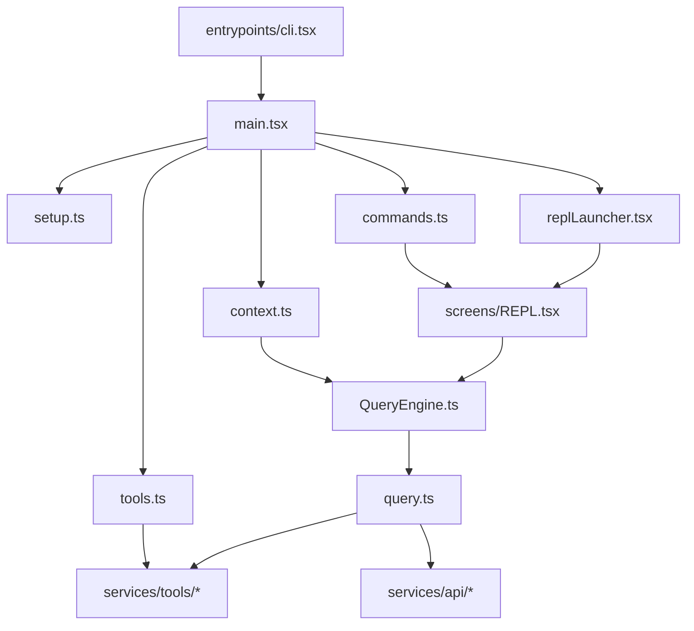

# Claude Code 源码精读教程总纲

> 目标：把 reference/claude-code 这个 Bun + TypeScript + React/Ink 的 CLI Agent 工程，拆成一套可以循序渐进阅读的源码精读教程。

## 一、先给结论：这个工程到底在做什么？

如果只用一句话概括，这个项目是在终端里实现一个可交互、可调用工具、可维护会话状态、可扩展技能与 MCP 能力的 AI Coding Agent。

它的主流程不是“用户问一句，模型答一句”，而是：

1. 从 CLI 启动，做最小化 fast-path 分流。
2. 进入 main.tsx，解析命令行参数，完成初始化、鉴权、配置加载和命令装配。
3. 根据运行模式进入 REPL、print 模式、daemon、bridge、MCP server 等不同分支。
4. 在 REPL 或 SDK 会话里构造 QueryEngine。
5. QueryEngine 在每轮用户输入时拼装 system prompt、user context、tools、commands、MCP clients。
6. query.ts 中的智能体循环负责发请求、接流式响应、提取 tool_use、执行工具、把 tool_result 喂回模型，直到本轮任务结束。
7. 整个过程中，权限系统、上下文系统、记忆系统、命令系统、插件系统和特性开关系统一起工作。

所以，这不是一个单纯的“聊天 CLI”，而是一个完整的“终端 Agent 操作系统”。

## 二、推荐阅读顺序

建议按下面的顺序看源码，不要一上来就钻 query.ts。

1. 先看入口：entrypoints/cli.tsx
2. 再看主装配：main.tsx
3. 再看初始化与渲染：setup.ts、interactiveHelpers.tsx、replLauncher.tsx
4. 再看上下文：context.ts，以及 system prompt 相关文档
5. 再看会话编排：QueryEngine.ts
6. 最后再看智能体循环核心：query.ts
7. 然后反过来补工具、权限、命令、技能、MCP、记忆等外围系统

这个顺序的原因很简单：

- main.tsx 决定“整个程序怎么进入工作状态”。
- QueryEngine 决定“单个会话如何编排”。
- query.ts 决定“单轮任务如何循环执行”。
- tools.ts、commands.ts、context.ts 则分别提供“能力池”“指令池”“上下文池”。

## 三、全书章节设计

### 第 1 章：全局架构与启动流程

重点回答：

- 这个项目的主模块分层是什么？
- CLI 从哪里启动？
- 为什么入口分成 cli.tsx 和 main.tsx 两层？
- fast-path 和完整初始化路径分别解决什么问题？

### 第 2 章：CLI 入口与 Commander 命令装配

重点回答：

- main.tsx 为什么这么大？
- Commander 在这里不是“命令定义文件”，而是整个运行时装配中心，这一点怎么理解？
- preAction 做了哪些真正关键的初始化？
- 默认 action 是如何把“交互模式、print 模式、resume、remote、ssh、assistant”等路线统一起来的？

### 第 3 章：环境初始化与首次渲染

重点回答：

- setup.ts 负责什么，为什么它不只是“初始化脚本”？
- 工作目录、worktree、tmux、hooks watcher、session memory 是怎么在启动时挂起来的？
- REPL 为什么通过 replLauncher.tsx 和 renderAndRun 两层渲染？
- 首次渲染之后又为什么要延迟启动一批 prefetch？

### 第 4 章：上下文构建与 System Prompt

重点回答：

- context.ts 的 system context 和 user context 分别是什么？
- git status、CLAUDE.md、日期为什么要分开构造？
- 为什么 system prompt 要做缓存友好的动态拼装？
- 项目记忆、CLAUDE.md 和普通消息上下文的职责边界是什么？

### 第 5 章：QueryEngine 会话编排

重点回答：

- 为什么项目里同时有 QueryEngine.ts 和 query.ts？
- QueryEngine 到底保存了哪些跨轮状态？
- submitMessage 做了哪些前置编排，才把任务送进 query.ts？
- 为什么说 QueryEngine 是“会话级 orchestrator”，而不是“模型调用器”？

### 第 6 章：query.ts 智能体循环

重点回答：

- query.ts 的 while(true) 循环每轮做什么？
- tool_use、tool_result、streaming、fallback、compact、stop hook 是如何串起来的？
- 为什么这个循环才是 Claude Code 的“智能体内核”？
- 它如何处理超长上下文、输出截断、模型切换和中断恢复？

### 第 7 章：工具系统与权限控制

重点回答：

- getAllBaseTools、getTools、assembleToolPool 分别处在工具装配链的哪一层？
- 为什么工具系统里有 feature flag、平台判断、权限过滤、REPL/simple mode 裁剪和 deny rule 前置过滤多层边界？
- partitionToolCalls、runTools、StreamingToolExecutor 如何把“可见工具”变成“可安全执行的工具调用”？
- 权限系统为什么要同时影响工具可见性、调用审批和失败反馈，而不是只做 UI 确认？

### 第 8 章：命令系统、技能与 MCP 扩展

重点回答：

- COMMANDS、getSkills、loadAllCommands、getCommands 这条命令装载链是怎么分层的？
- dynamic skills 为什么不直接塞进冷启动缓存，而要单独插层？
- getSkillToolCommands、getSlashCommandToolSkills、getMcpSkillCommands 分别服务谁？
- 为什么命令系统其实是“面向人、面向模型、面向远程桥接场景”的多视角能力索引？

### 第 9 章：记忆、会话恢复与工程化设计

重点回答：

- memory files、CLAUDE.md、memdir 自动记忆机制分别通过哪条链路进入会话？
- history.ts、sessionStorage.ts、conversationRecovery.ts、sessionRestore.ts 各自负责哪一种“持久化”？
- Session 持久化和 resume 为什么不是 QueryEngine 自己做，而是单独拆成恢复工程层？
- worktree、todo、file history、context collapse 这些副状态是怎样跟着 resume 一起被恢复的？

### 第 10 章：REPL 交互层与输入提交流程

重点回答：

- REPL.tsx 为什么会这么大？
- 用户输入是如何从 PromptInput 一路流到 onSubmit、handlePromptSubmit、processUserInput 和 onQuery 的？
- REPL 如何把 commands、tools、MCP、notifications、dialogs 聚合成一份“当前交互世界”？
- QueryGuard 的 reserve、tryStart、end、forceEnd 为什么需要三态机而不是布尔 loading？
- queue、interrupt、immediate local-jsx command 这些交互策略为什么必须停留在 UI 桥接层？

### 第 11 章：工具执行器与并发控制

重点回答：

- partitionToolCalls、runTools、runToolsConcurrently、runToolsSerially 之间是怎样分工的？
- 工具并发安全为什么既取决于工具类型，也取决于具体输入？
- 为什么并发执行后的 contextModifier 必须按原顺序回放，而不能随完成顺序落地？
- StreamingToolExecutor 的状态机、sibling abort、synthetic error 和 discard 是怎么共同维持轨迹闭合的？

### 第 12 章：API 通信、Prompt Cache 与上下文压缩

重点回答：

- toolToAPISchema、splitSysPromptPrefix、buildSystemPromptBlocks 是如何把提示词和工具 schema 变成稳定 API 请求的？
- 为什么 MCP tools、provider 差异和 beta shape 会直接影响 cache scope 与请求结构？
- getEffectiveContextWindowSize、calculateTokenWarningState、shouldAutoCompact、autoCompactIfNeeded 是怎样组成预算治理链的？
- Claude Code 是如何在“上下文窗口、缓存命中、协议兼容、恢复能力”之间做平衡的？

## 四、建议的源码主线图

## 五、阅读方法建议

这套工程不适合“按目录树平均阅读”，建议采用下面的方法：

1. 先找总线文件：main.tsx、QueryEngine.ts、query.ts、tools.ts、commands.ts、context.ts。
2. 每读到一个外部函数调用，就先判断它属于哪一层：启动层、会话层、循环层、工具层、扩展层。
3. 把“什么时候调用”和“为什么现在调用”写出来，而不是只记“它做了什么”。
4. 尤其关注源码注释，这个项目很多关键设计意图都直接写在注释里。

## 六、全书使用说明

这套教程不是 API 手册，而是“执行链路精读”。

所以每一章都会按下面的模板展开：

1. 模块职责
2. 执行链路
3. 关键源码片段
4. 设计动机
5. 与其他模块的关系
6. 阅读时容易忽略的点

接下来从第 1 章开始，先把整条启动总线梳理清楚。
