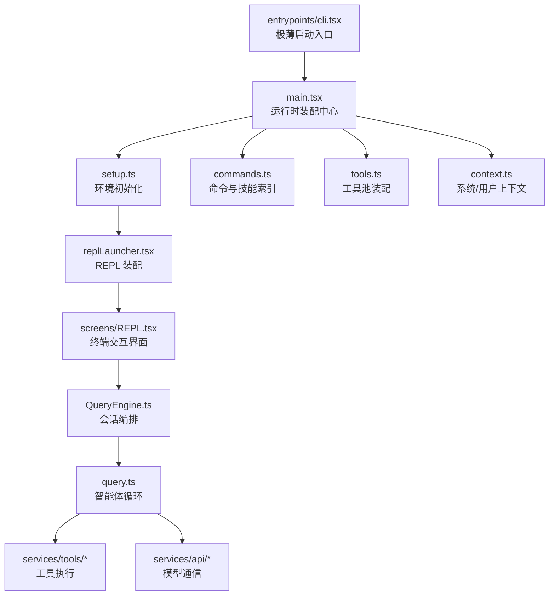

# 第 1 章 全局架构与启动流程

> 本章先不陷进局部细节，而是回答一个最重要的问题：Claude Code 这套工程，整体是怎么组织起来的，程序又是怎样从命令行一步步走到智能体主循环里的。

## 1.1 为什么这章必须最先看

这个项目的复杂度，不在单个算法，而在“多层系统如何衔接”：

- 有 CLI 启动层
- 有运行时装配层
- 有 REPL 交互层
- 有会话编排层
- 有 query 智能体循环层
- 有工具、命令、权限、记忆、MCP 等外围支撑层

如果没有先拿到一张全景地图，后面去看 query.ts、QueryEngine.ts、tools.ts 这些文件时，很容易把“当前层职责”和“它依赖的上一层职责”混在一起。

所以这章的目的不是讲所有细节，而是先把主链路钉住。

## 1.2 一句话概括整个工程

Claude Code 可以被理解成这样一个系统：

一个运行在终端里的 AI Agent 宿主程序，它负责建立会话、维护上下文、暴露工具能力、执行权限检查，并通过一个流式循环驱动模型不断规划和行动，直到任务完成。

这里有三个关键词必须记住：

1. 宿主程序
2. 会话
3. 循环

模型不是整个系统本身，模型只是这个宿主系统中的规划器之一。

## 1.3 整体分层图



这张图有一个最重要的信息：

主链路不是直接从 UI 跳到模型，而是经过两层核心中枢：

- QueryEngine：会话级编排中枢
- query.ts：单轮任务执行中枢

## 1.4 第一层：entrypoints/cli.tsx 是“极薄入口”

这个文件的职责非常明确：尽可能轻地处理启动 fast-path，避免为了一个简单命令把整个程序都加载起来。

例如：

- --version 直接输出版本
- 某些特殊 server 模式直接分流
- 某些 daemon/bridge/bg/template runner 路径直接跳走

一段非常典型的代码是：

```ts
async function main(): Promise<void> {
    const args = process.argv.slice(2)

    if (
        args.length === 1 &&
        (args[0] === '--version' || args[0] === '-v' || args[0] === '-V')
    ) {
        console.log(`${MACRO.VERSION} (Claude Code)`)
        return
    }

    const { profileCheckpoint } = await import('../utils/startupProfiler.js')
    profileCheckpoint('cli_entry')
    ...
}
```

这个设计背后的思路很清楚：

- 能快速返回的路径就不要拉起完整运行时
- 只有进入主业务路径时，才加载沉重模块

所以 cli.tsx 更像“启动路由器”，而不是“程序本体”。

## 1.5 第二层：main.tsx 是真正的运行时装配中心

一旦离开 cli.tsx 的 fast-path，主程序就进入 main.tsx。

main.tsx 做的不是单一工作，而是统一承担：

1. 命令行解析
2. 初始化时序控制
3. 运行模式分流
4. 命令、工具、MCP、技能、agents 的装配
5. 进入交互式或非交互式主路径

它的一个关键特征，是顶部就启动一批“可并行预取”的能力：

```ts
profileCheckpoint('main_tsx_entry')
startMdmRawRead()
startKeychainPrefetch()
```

这说明作者对冷启动时延非常敏感，会把高延迟 I/O 提前发出去，与后续模块加载重叠。

## 1.6 第三层：setup.ts 负责搭好运行环境底盘

main.tsx 不会直接开 REPL，而是先调用 setup() 把运行环境搭起来。

setup.ts 主要负责：

- 设置 cwd
- 处理 session id
- 初始化 hooks 快照与 watcher
- worktree/tmux 相关逻辑
- 启动必要的 session memory 和后台初始化

这里有一段非常关键：

```ts
setCwd(cwd)
captureHooksConfigSnapshot()
initializeFileChangedWatcher(cwd)
```

这三句看似普通，实际上决定了后面：

- 工具访问基准目录
- hooks 配置安全边界
- 文件变化感知能力

换句话说，setup.ts 搭的是“运行底座”，不是“功能插件”。

## 1.7 第四层：REPL 渲染只是表层，关键是 UI 生命周期托管

程序进入交互式模式后，并不是直接在 main.tsx 里 render 一个组件，而是通过 replLauncher.tsx 和 interactiveHelpers.tsx 两层装配。

核心流程是：

1. launchRepl() 动态加载 App 与 REPL 组件
2. renderAndRun() 负责真正渲染、等待退出、优雅关停
3. startDeferredPrefetches() 在首屏后再启动一批延迟预热任务

renderAndRun 的实现非常短，但非常说明问题：

```tsx
export async function renderAndRun(root: Root, element: React.ReactNode): Promise<void> {
  root.render(element)
  startDeferredPrefetches()
  await root.waitUntilExit()
  await gracefulShutdown(0)
}
```

这说明 UI 层在整个系统里只是一个托管界面，真正重要的是 REPL 生命周期由宿主程序控制，而不是组件自己控制。

## 1.8 第五层：QueryEngine 负责会话级编排

进入 REPL 之后，真正处理用户消息的不是 UI 组件本身，而是 QueryEngine。

可以把 QueryEngine 看成“一个会话的控制器”。

它负责持有和维护这些跨轮状态：

- 消息历史
- 文件缓存
- 权限拒绝记录
- token usage 统计
- memory/skills 相关运行态

QueryEngine 的定位在源码注释里写得很直接：

```ts
/**
 * One QueryEngine per conversation. Each submitMessage() call starts a new
 * turn within the same conversation.
 */
```

也就是说，它回答的是“一个会话如何持续存在并不断推进”，而不是“某一次模型调用怎么发”。

## 1.9 第六层：query.ts 负责单轮智能体循环

如果 QueryEngine 负责管理会话，那 query.ts 负责管理“单轮任务是怎么跑完的”。

它通过一个 while(true) 异步生成器循环来完成：

1. 组装消息
2. 调模型
3. 接流式结果
4. 识别 tool_use
5. 执行工具
6. 回灌 tool_result
7. 看是否要继续下一轮

这层才是 Claude Code 真正意义上的 agentic loop 核心。

## 1.10 三个最重要的横切系统

除了启动主链路，整个工程还有三套横切系统贯穿始终。

### 1. context.ts

负责系统上下文和用户上下文，包括：

- git status
- CLAUDE.md
- 当前日期

### 2. commands.ts

负责命令、skills、plugin commands、workflow commands 的统一索引。

### 3. tools.ts

负责内建工具和 MCP 工具的组装与权限过滤。

这三者共同决定：

- 模型知道什么
- 模型能做什么
- 用户和模型各自能触发什么能力

## 1.11 启动路径总流程图

下面这张图可以作为后续所有章节的参照。

```mermaid
sequenceDiagram
        participant U as 用户
        participant CLI as entrypoints/cli.tsx
        participant MAIN as main.tsx
        participant SETUP as setup.ts
        participant UI as REPL/App
        participant QE as QueryEngine
        participant LOOP as query.ts
        participant TOOLS as Tool Runtime

        U->>CLI: 启动 claude
        CLI->>CLI: fast-path 判断
        CLI->>MAIN: 进入完整启动路径
        MAIN->>MAIN: 解析参数/初始化/装配命令和工具
        MAIN->>SETUP: 建立运行环境
        SETUP->>UI: 准备交互态
        UI->>QE: 提交用户消息
        QE->>LOOP: 启动单轮 query
        LOOP->>TOOLS: 调用工具
        TOOLS-->>LOOP: 返回 tool_result
        LOOP-->>QE: 返回 assistant/tool messages
        QE-->>UI: 更新会话状态和输出
```

## 1.12 这一章应该记住什么

如果这章只记三件事，我建议记这三件：

1. cli.tsx 是启动分流器，main.tsx 才是运行时装配中心。
2. QueryEngine 负责会话，query.ts 负责单轮智能体循环，这两个层次不能混。
3. context、commands、tools 是横切系统，它们决定了模型“知道什么、能做什么”。

## 1.13 下一章要怎么读

下一章建议直接盯着 main.tsx 和 commands.ts 看，不要急着往 REPL.tsx 深挖。

因为在这个项目里，真正复杂的不是 UI，而是“进入 UI 之前系统已经装配好了什么”。
