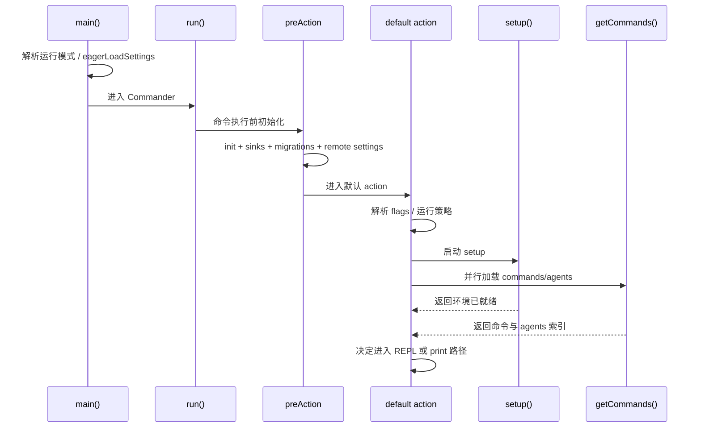

# 第 2 章 CLI 入口与 Commander 命令装配

> 对应源码主线：src/main.tsx、src/commands.ts、src/entrypoints/cli.tsx

## 2.1 main.tsx 为什么是“总装配中心”

很多人第一次看到这个项目，会问一个问题：为什么 main.tsx 这么大？

原因不是代码失控，而是这个文件承担了三个角色：

1. CLI 参数解析中心
2. 运行时初始化调度中心
3. 默认交互模式的总入口

也就是说，它并不只是“命令定义文件”，而是把整个系统真正装起来的地方。

## 2.2 程序进入 main.tsx 之后先做了什么

main.tsx 顶部最值得注意的，不是 Commander，而是大量“必须尽早发生”的 side effect：

```ts
profileCheckpoint('main_tsx_entry')
startMdmRawRead()
startKeychainPrefetch()
```

这里体现了一个很重要的工程思想：

启动阶段把高延迟但可并行的 I/O 提前打出去，和后续模块加载重叠执行，压缩首屏等待时间。

然后 main.tsx 会立刻导入一批核心模块，包括：

- context.ts：上下文构造
- commands.ts：命令系统
- tools.ts：工具系统
- setup.ts：环境初始化
- replLauncher.tsx：REPL 启动
- 各种 auth、analytics、policy、plugin、skills、MCP 相关模块

这意味着 main.tsx 是全局依赖收束点。

## 2.3 main() 的职责不是“运行逻辑”，而是“路线分流”

main.tsx 里的 main() 做的第一件事，不是直接开 REPL，而是尽可能早地识别特殊运行路线。

例如：

- deep link
- direct connect
- assistant 模式
- ssh 远程模式
- print 模式
- sdk url 模式

源码中这一段很关键：

```ts
const hasPrintFlag = cliArgs.includes('-p') || cliArgs.includes('--print')
const hasInitOnlyFlag = cliArgs.includes('--init-only')
const hasSdkUrl = cliArgs.some((arg) => arg.startsWith('--sdk-url'))
const isNonInteractive = hasPrintFlag || hasInitOnlyFlag || hasSdkUrl || !process.stdout.isTTY
```

这段代码决定了后面整个程序走“交互式 REPL”还是“非交互脚本/SDK 管道”。

也就是说，Claude Code 的运行模式判断很早，很多初始化行为都会受这个布尔值影响。

## 2.4 eagerLoadSettings 为什么要放到 init() 之前

main() 里还有一步很关键：

```ts
eagerLoadSettings()
await run()
```

eagerLoadSettings 的作用是，在真正 init() 前提前解析：

- --settings
- --setting-sources

原因在于：后面初始化链路里很多逻辑都依赖配置，比如：

- 权限模式
- 环境变量注入
- 模型相关设置
- hooks/plugin 行为

如果不在 init() 之前把这些外部配置先挂进去，后面的初始化就是基于错误配置运行的。

## 2.5 Commander 的真正入口：run()

run() 才开始真正构建 Commander program。

在这里有一个很关键的 preAction：

```ts
program.hook('preAction', async (thisCommand) => {
  await Promise.all([ensureMdmSettingsLoaded(), ensureKeychainPrefetchCompleted()])
  await init()
  initSinks()
  runMigrations()
  void loadRemoteManagedSettings()
  void loadPolicyLimits()
})
```

这段代码非常值得反复看，因为它说明：

1. CLI 命令执行前，会先补齐前面预取但未 await 的系统设置读取。
2. init() 是真正全局初始化点。
3. telemetry/log sinks 在这里统一接好。
4. migrations 在这里执行，而不是散落到配置访问处。
5. remote managed settings 与 policy limits 是后台异步刷新的。

换句话说，preAction 是“所有命令执行前的统一冷启动屏障”。

把这段函数级骨架单独拎出来看，会更容易理解它为什么是“屏障”而不是“普通 hook”：

```ts
program.hook('preAction', async (thisCommand) => {
  await Promise.all([ensureMdmSettingsLoaded(), ensureKeychainPrefetchCompleted()])
  await init()
  initSinks()
  runMigrations()
  void loadRemoteManagedSettings()
  void loadPolicyLimits()
})
```

这里关键不是列出几个初始化函数，而是它们的先后顺序被固定了下来：先收口启动早期并行预取，再做全局 init，然后把 sinks 和 migrations 接上，最后异步刷新远端受管设置与策略限制。Commander 在这里已经不只是参数解析器，而是统一运行时进入命令执行前的最后一道装配关口。

## 2.6 为什么默认 action 会非常长

默认 action 承担的是“没有进入特殊 subcommand 时的主业务路径”。

这个 action 里要处理的事情很多：

1. 解析 print、verbose、input/output format
2. 处理 bare mode
3. 处理 worktree、tmux、session id、resume、continue
4. 处理 assistant、remote、ssh、direct connect
5. 处理 mcp config、plugin dir、agents、skills
6. 处理 file download、CLAUDE_CODE_REMOTE 等环境
7. 准备 commands、tools、MCP、agent definitions
8. 决定最后是进入 REPL，还是进入 print/headless 路径

所以你看到的不是一个“过长的 action”，而是整个产品默认主路径的装配全过程。

默认 action 之所以显得长，还有一个很具体的原因：它把 setup 与命令/agent 定义加载做了按条件并行。源码骨架大致如下：

```ts
const setupPromise = setup(...)
const commandsPromise = worktreeEnabled ? null : getCommands(preSetupCwd)
const agentDefsPromise = worktreeEnabled
  ? null
  : getAgentDefinitionsWithOverrides(preSetupCwd)

await setupPromise

const [commands, agentDefinitionsResult] = await Promise.all([
  commandsPromise ?? getCommands(currentCwd),
  agentDefsPromise ?? getAgentDefinitionsWithOverrides(currentCwd),
])
```

这段代码很能体现 main.tsx 的启动哲学：只要 worktree 还没介入、cwd 不会变化，就尽量把磁盘扫描与环境搭建重叠起来。也就是说，default action 的复杂度有一部分其实来自性能优化后的时序编排，而不是单纯功能堆叠。

## 2.7 commands.ts 的角色：命令不是静态表，而是动态组合结果

commands.ts 里最重要的不是 COMMANDS 常量，而是 getCommands(cwd)。

核心逻辑如下：

```ts
const loadAllCommands = memoize(async (cwd: string): Promise<Command[]> => {
  const [{ skillDirCommands, pluginSkills, bundledSkills, builtinPluginSkills }, pluginCommands, workflowCommands] =
    await Promise.all([
      getSkills(cwd),
      getPluginCommands(),
      getWorkflowCommands ? getWorkflowCommands(cwd) : Promise.resolve([]),
    ])

  return [
    ...bundledSkills,
    ...builtinPluginSkills,
    ...skillDirCommands,
    ...workflowCommands,
    ...pluginCommands,
    ...pluginSkills,
    ...COMMANDS(),
  ]
})
```

这里说明一个核心事实：Claude Code 的 slash command 体系，根本不是单纯的本地命令表，而是下面几类能力的拼装结果：

- 内建命令
- bundled skills
- skills 目录下动态发现的技能
- plugin commands
- workflow commands

所以命令系统本质上是“能力索引层”。

## 2.8 getCommands() 为什么不是单纯返回缓存

getCommands() 并不是简单把 loadAllCommands 的 memoize 结果直接吐出来，它还会重新做可用性判断：

```ts
const baseCommands = allCommands.filter((_) => meetsAvailabilityRequirement(_) && isCommandEnabled(_))
```

这一步每次都重新执行，原因很实际：

- 登录状态可能刚变化
- feature gate 可能刚刷新
- 配置可能刚热更新
- 某个 command 的 isEnabled() 依赖运行态

所以这里采用的是“重载昂贵部分缓存，轻量可用性判断实时算”的策略。

## 2.9 命令系统有两层索引：给人用，给模型用

commands.ts 里还有两个很重要的函数：

- getSkillToolCommands(cwd)
- getSlashCommandToolSkills(cwd)

它们不是给交互式 slash command 列表用的，而是给模型可调用 skill 索引用的。

也就是说，同一套命令对象，在系统里同时服务两类消费者：

1. 人类用户，在 REPL 里敲 /xxx
2. 模型，通过 SkillTool 间接调用 prompt 型 skill

这正是 Claude Code 很有意思的一点：命令系统和工具系统不是割裂的，命令也能转化成模型能力。

## 2.10 这一章的阅读结论

读完 main.tsx 和 commands.ts，应该先建立三个认识：

1. main.tsx 是运行时装配中心，不只是入口文件。
2. Commander 在这里不仅负责命令解析，也承担初始化调度屏障的职责。
3. commands.ts 不是命令列表，而是把技能、插件、工作流、本地命令统一收敛成能力索引的入口。

下一章继续看 setup.ts、interactiveHelpers.tsx、replLauncher.tsx，理解“命令装配完成之后，程序是怎么真正进入可交互状态的”。

## 2.11 main() 的函数级路线分流链

如果只看 main()，最容易误以为它只是“跑 run() 之前做点预处理”。

其实它内部是一条非常明确的路线分流链：

1. 设置基础进程保护，例如 Windows 的 NoDefaultCurrentDirectoryInExePath
2. 初始化 warning handler 和 SIGINT/exit 等进程级行为
3. 识别并改写 deep link / direct connect / assistant / ssh 等特殊 argv
4. 计算 isNonInteractive，并写入 bootstrap state
5. 设置 clientType 和 previewFormat
6. eagerLoadSettings()
7. 最后才进入 run()

也就是说，main() 不是“开始执行业务”，而是在给 run() 准备一个已经完成模式判定的运行环境。

## 2.12 preAction 为什么是 Commander 路径里的真正初始化屏障

很多 CLI 工程会把初始化写在 run() 外层，但这个项目选择把关键初始化放进 preAction。

这是因为它要满足两个目标：

1. 显示 help 时尽量轻，不要把整套系统拉起来
2. 真正执行任意命令时，又必须保证初始化顺序一致

preAction 里最重要的函数级顺序是：

```ts
await Promise.all([ensureMdmSettingsLoaded(), ensureKeychainPrefetchCompleted()])
await init()
initSinks()
runMigrations()
void loadRemoteManagedSettings()
void loadPolicyLimits()
```

这个顺序背后的逻辑是：

- 先等早期并行预取真正完成
- 再做全局 init
- 再把日志/遥测 sinks 接起来
- 再做配置迁移
- 最后把远端策略和受管设置异步刷新出去

也就是说，preAction 是“命令执行前最后一次保证状态完整”的关口。

## 2.13 默认 action 的真正结构：不是大，而是分阶段装配

main.tsx 里的默认 action 很长，但如果按阶段去拆，其实结构非常清楚：

### 第一阶段：解析输入与运行模式

这一段主要处理：

- bare / print / verbose / init / maintenance
- worktree / tmux / session id / resume / continue
- assistant / teammate / remote / sdk url
- system prompt file / append system prompt file

### 第二阶段：预备能力集合

这一段主要处理：

- getTools(toolPermissionContext)
- structured output synthetic tool
- initBuiltinPlugins()
- initBundledSkills()

### 第三阶段：setup 与并行装载

这里是整个启动里非常关键的一段：

```ts
const setupPromise = setup(...)
const commandsPromise = worktreeEnabled ? null : getCommands(preSetupCwd)
const agentDefsPromise = worktreeEnabled ? null : getAgentDefinitionsWithOverrides(preSetupCwd)
await setupPromise
const [commands, agentDefinitionsResult] = await Promise.all([
  commandsPromise ?? getCommands(currentCwd),
  agentDefsPromise ?? getAgentDefinitionsWithOverrides(currentCwd),
])
```

这段代码说明作者在刻意重叠：

- setup() 的环境搭建
- commands / agents 的磁盘装载

只要不涉及 worktree 导致的 cwd 改变，就提前并行，减少冷启动等待。

### 第四阶段：解析 agent / model / advisor 等会话策略

这一阶段的重点是把 CLI 层参数变成会话级运行策略：

- mainThreadAgentDefinition
- mainLoopModelOverride
- advisorModel
- custom system prompt
- teammate prompt addendum

### 第五阶段：决定进入哪条执行路径

最后才分出：

- 交互式 REPL
- headless print
- remote / teleport / ssh 等分支

所以默认 action 的本质不是“大块业务代码”，而是一台多阶段装配机。

## 2.14 getCommands() 与 main.tsx 的耦合点

main.tsx 和 commands.ts 的关系，不只是“调用一下 getCommands()”。

它们之间真正关键的耦合点有两个：

1. getCommands() 依赖 skills/plugins/workflows 是否已注册
2. main.tsx 必须在合适时机启动这些注册动作，避免缓存被过早打下

源码里已经明确写到：

- bundled skills/plugins 要在 kick getCommands() 之前先注册

否则一旦 memoized command list 先生成，后面再注册也来不及了。

这类问题非常像大型系统里的“初始化时序错误”，不是功能 bug，而是装配 bug。

## 2.15 这一章最值得画在脑子里的图



## 2.16 这一章和后续章节怎么衔接

第 2 章的价值，在于它第一次把“入口文件”还原成了真正的运行时装配器。

1. 它会直接通向第 3 章，因为命令装配完成之后，程序下一步要解决的就是 setup、信任边界和首次渲染这些运行现场问题。
2. 它会回流到第 8 章，因为 commands.ts 在这里先以启动装配的一部分出现，后面才会被展开成命令、技能和 MCP 能力索引。
3. 它也会延伸到第 14 章和第 20 章，因为 remote、ssh、direct connect 这些模式虽然在入口期就被识别，但要到后面才会真正展开为执行拓扑和统一控制面。

所以第 2 章最好的读法，不是把它当成“参数解析章节”，而是把它看成统一运行时从入口进入装配态的第一道总线。
