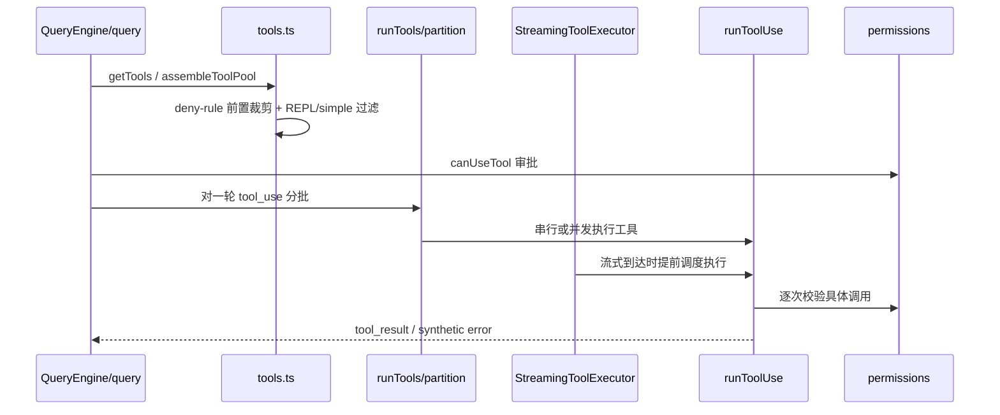

# 第 7 章 工具系统与权限控制

> 对应源码主线：src/tools.ts，以及权限相关模块

## 7.1 tools.ts 解决的不是“有哪些工具”，而是“当前会话允许看到哪些工具”

tools.ts 的第一层职责当然是注册工具，但更重要的是“裁剪”。

因为对于 Agent 来说，工具池从来都不是固定集合，而是运行态结果。

它会受到这些因素影响：

- feature flag
- 平台差异
- USER_TYPE
- bare/simple mode
- REPL mode
- worktree mode
- 是否启用 LSP
- deny rules
- MCP tools 是否接入

所以 tools.ts 的核心价值是“组装当前可见的能力边界”。

## 7.2 getAllBaseTools() 是内建工具全集

这个函数返回了当前环境下所有可能的内建工具。

其中既有稳定工具：

- AgentTool
- BashTool
- FileReadTool
- FileEditTool
- FileWriteTool
- NotebookEditTool
- WebFetchTool
- WebSearchTool
- TodoWriteTool
- AskUserQuestionTool

也有大量条件启用工具：

- SleepTool
- MonitorTool
- LSPTool
- ToolSearchTool
- EnterWorktreeTool / ExitWorktreeTool
- PowerShellTool
- MCP resource tools

这说明工具层不是一个静态数组，而是受构建时和运行时双重条件控制的能力表。

## 7.3 getTools() 真正做的是多层过滤

getTools() 的核心不是“返回 tools”，而是按当前模式选择和裁剪。

其中最关键的一条分支是 simple mode：

```ts
if (isEnvTruthy(process.env.CLAUDE_CODE_SIMPLE)) {
  const simpleTools: Tool[] = [BashTool, FileReadTool, FileEditTool]
  ...
  return filterToolsByDenyRules(simpleTools, permissionContext)
}
```

这意味着一旦进入 SIMPLE，系统就会把工具池收缩到最小集。

这对安全和性能都很重要：

- 降低模型能力边界
- 降低 prompt 中工具描述长度
- 适合脚本化和最小运行环境

## 7.4 deny rule 过滤是前置过滤，不是执行时兜底

tools.ts 里有一个很重要的函数：filterToolsByDenyRules()。

它会在工具展示给模型之前，就把被 blanket deny 的工具移除掉。

这意味着权限策略不是只在“用户点确认时”生效，而是在“模型看到什么能力”这一层就已经介入。

这是很关键的设计：

- 如果模型根本看不到某个工具，它就不会规划使用它。
- 如果只在调用时拒绝，模型还会不断尝试，导致对话变差。

所以 deny rule 是 prompt 级边界，不只是 runtime guard。

## 7.5 assembleToolPool()：内建工具和 MCP 工具如何合并

这个函数非常重要：

```ts
export function assembleToolPool(permissionContext: ToolPermissionContext, mcpTools: Tools): Tools {
  const builtInTools = getTools(permissionContext)
  const allowedMcpTools = filterToolsByDenyRules(mcpTools, permissionContext)

  const byName = (a: Tool, b: Tool) => a.name.localeCompare(b.name)
  return uniqBy([...builtInTools].sort(byName).concat(allowedMcpTools.sort(byName)), 'name')
}
```

它解决的是完整工具池装配问题：

1. 先拿内建工具
2. 再过滤 MCP 工具
3. 按名称排序保证 prompt cache 稳定
4. built-in 在重名冲突时优先

这里尤其值得注意“排序为了 prompt-cache 稳定”这一点。

这意味着工具池顺序不是无关紧要的实现细节，而是会影响缓存命中率的系统行为。

## 7.6 getTools() 和 assembleToolPool() 的区别

很多人第一次读容易混：

- getTools(permissionContext)
- assembleToolPool(permissionContext, mcpTools)
- getMergedTools(permissionContext, mcpTools)

它们的区别是：

### getTools

只拿内建工具，并按当前模式做过滤。

### assembleToolPool

内建工具 + MCP 工具，且会做 deny rule 过滤和去重，是“最终给模型看的主工具池”。

### getMergedTools

只是简单拼起来，适合做统计和阈值判断等用途。

这个分层设计避免了一个常见问题：

不同调用方各自随手拼 tools，最后行为不一致。

## 7.7 工具系统为什么要和权限系统强耦合

在普通 CLI 里，权限往往只是 UI 配置。

但在 Claude Code 里，权限系统必须和工具系统深度耦合，原因是：

模型会主动规划工具使用。

这意味着权限系统至少要影响三件事：

1. 模型能不能看到这个工具
2. 模型发起调用后是否允许执行
3. 失败后要如何把拒绝反馈给会话系统

前面 QueryEngine 包装 canUseTool、这里 tools.ts 过滤 deny rules，正好就是这三层中的两层。

## 7.8 工具系统体现了“能力边界先于功能实现”

这个工程有一个值得反复学习的思想：

先定义 Agent 在当前会话中“能做什么”，再让模型去规划。

也就是说：

- 能力边界是宿主程序决定的
- 模型只是边界内的规划器

这和“把所有工具全扔给模型再靠提示词约束”完全不同。

这也是它更像工程系统，而不是 demo agent 的原因。

## 7.9 这一章的阅读结论

这一章可以浓缩成四个结论：

1. tools.ts 管的不只是注册，更关键的是运行态裁剪。
2. 工具池是 feature、平台、模式、权限、MCP 多因素共同决定的结果。
3. deny rule 的前置过滤能显著改善模型规划质量和系统安全性。
4. Claude Code 的设计核心之一是：先收紧能力边界，再允许模型行动。

下一章看 commands.ts、skills、MCP 这一整条扩展能力链，理解“人用命令”和“模型用技能”是如何汇合到一套系统里的。

## 7.10 getAllBaseTools() 才是工具系统的“总注册表”

前面讲 getTools() 时，容易把注意力放在“当前返回了哪些工具”。

但从源码结构上看，真正更关键的是 getAllBaseTools()。

因为它承担的是“当前环境下可能存在的全部内建工具定义”的总注册职责。

源码里甚至有一条很醒目的注释：

```ts
/**
 * NOTE: This MUST stay in sync with ... global_system_caching,
 * in order to cache the system prompt across users.
 */
export function getAllBaseTools(): Tools { ... }
```

这句注释很值得反复体会。它说明 getAllBaseTools() 不是随手维护的一组 import，而是会直接影响：

1. 工具描述顺序
2. system prompt 中的工具块稳定性
3. prompt cache 是否跨用户命中

换句话说，这个函数不仅是功能注册点，还是缓存协议的一部分。

## 7.11 getTools() 的函数级过滤链

如果把 getTools(permissionContext) 直着读一遍，它其实是一条很清晰的过滤流水线：

1. 先看是否处于 CLAUDE_CODE_SIMPLE
2. simple 模式下再判断是否启用 REPL mode
3. 必要时补 coordinator mode 额外工具
4. 非 simple 模式下，从 getAllBaseTools() 拿全集
5. 移除特殊工具，例如 MCP resource tools 和 synthetic output tool
6. 用 filterToolsByDenyRules() 做前置权限裁剪
7. 若 REPL mode 开启，再隐藏原始 primitive tools
8. 最后才跑每个工具自己的 isEnabled()

这里顺序不能乱。

尤其最后一步 isEnabled() 放在 deny-rule 和 REPL 裁剪之后，意味着作者在刻意减少无意义判断，只对“理论上还能留下”的工具做运行态启用检查。

## 7.12 simple mode 和 REPL mode 的叠加语义

getTools() 里最容易忽略的细节，是 simple mode 和 REPL mode 叠加时，返回的并不是 Bash、Read、Edit，而是 REPLTool。

源码明确写着：

```ts
if (isEnvTruthy(process.env.CLAUDE_CODE_SIMPLE)) {
  if (isReplModeEnabled() && REPLTool) {
    const replSimple: Tool[] = [REPLTool]
    ...
    return filterToolsByDenyRules(replSimple, permissionContext)
  }
  const simpleTools: Tool[] = [BashTool, FileReadTool, FileEditTool]
  ...
}
```

这背后的产品语义是：

- simple 代表缩小能力边界
- REPL mode 代表把底层原语收进 VM / REPL 容器里

因此两者叠加后的结果不是“更少的原始工具”，而是“只暴露一个更高层的 REPL 包装器”。

这是一种很典型的能力封装思路：

不是简单删除能力，而是把原语放进受控宿主里再暴露。

## 7.13 filterToolsByDenyRules() 为什么这么关键

从代码上看，filterToolsByDenyRules() 很短：

```ts
export function filterToolsByDenyRules(...)
```

但它的语义非常重。

因为它并不是“执行失败时返回拒绝”，而是在工具进入模型视野之前，就把整类工具剔除掉。

更重要的是，它复用了和运行时 permission check 同一套规则匹配语义，因此像：

- `Bash`
- `mcp__server`
- `mcp__server__*`

这类规则，不只会阻止真实执行，也会改变模型看到的工具池。

这就是前面提到的“prompt 级边界”。

如果只在执行时 deny，模型仍然会基于错误能力图做规划；而前置裁剪会让模型从一开始就少走弯路。

## 7.14 assembleToolPool() 与 getMergedTools() 的职责差异

这两个函数名字很像，但语义完全不同。

### assembleToolPool

它是“最终给模型看的工具池”。

执行链是：

1. getTools(permissionContext)
2. filterToolsByDenyRules(mcpTools, permissionContext)
3. built-in 和 MCP 分区分别排序
4. uniqBy(name) 去重，且 built-in 优先

其中最关键的是“分区排序而不是扁平排序”。

源码注释已经把原因写透了：

- built-in tools 要保持连续前缀
- 否则 MCP tools 插进中间，会破坏下游 cache key

这说明 assembleToolPool() 的目标不只是“拼出来”，而是“拼得足够稳定”。

### getMergedTools

它只是：

```ts
return [...builtInTools, ...mcpTools]
```

也就是说，它更适合：

- 统计
- token 估算
- 工具搜索阈值判断

而不是直接拿去给模型做正式工具描述。

## 7.15 工具权限并不是只有一层

如果把整条链路连起来看，工具权限至少分成三层：

### 第一层：可见性层

由 tools.ts 决定。通过 getTools()、filterToolsByDenyRules()、assembleToolPool() 控制“模型能看到什么”。

### 第二层：调用审批层

由 QueryEngine 包装后的 canUseTool 和 permissions 模块决定。即便工具可见，每次具体调用是否允许，仍然要过审批链。

### 第三层：执行反馈层

由 runToolUse()、tool hooks、tool result message 决定。执行失败、用户拒绝、hook 拦截，最终都要回流成消息，重新进入 query loop。

这三层合在一起，才是 Claude Code 真正的工具安全模型。

## 7.16 partitionToolCalls()：并发不是“全开”，而是先分批

toolOrchestration.ts 里最重要的不是 runTools() 本身，而是 partitionToolCalls()。

它会把一轮 tool_use 拆成若干批次，每个批次只有两种可能：

1. 单个非并发安全工具
2. 多个连续的并发安全工具

核心判断来自：

```ts
const isConcurrencySafe = parsedInput?.success ? Boolean(tool?.isConcurrencySafe(parsedInput.data)) : false
```

这意味着并发不是按工具名硬编码，而是可以依赖具体输入动态判断。

例如同一个 BashTool，不同命令可能就有不同并发安全性。

这是一种比“按工具类型一刀切”更细的设计。

## 7.17 runTools() 的真正难点：并发执行，但上下文修改按顺序回放

runTools() 最值得精读的地方，是它对并发安全批次的处理方式。

对并发批次，它会：

1. 并发执行所有 read-only / concurrency-safe tool
2. 先把 message 流式往外吐
3. 把 contextModifier 暂存到 queuedContextModifiers
4. 等整批结束后，再按照原始 tool_use 顺序依次回放 modifier

这段逻辑非常精妙，因为它同时满足两个目标：

- 用户能尽早看到工具输出
- 会话上下文仍然保持确定性更新顺序

如果一边并发执行一边立即改 context，就会出现“谁先跑完谁先改状态”的不确定性。

现在这种做法，本质上是在做：

- 执行并发
- 状态提交串行

这和数据库里的两阶段提交思路很像。

## 7.18 StreamingToolExecutor：一边流入 tool_use，一边开始执行

如果说 runTools() 处理的是“整批 tool_use 已经收齐”的情况，那么 StreamingToolExecutor 处理的是更复杂的场景：

- 模型响应还在流式生成
- 新的 tool_use block 可能继续到来
- 已经到来的工具希望尽早开始执行

它内部维护了每个工具的状态：

- queued
- executing
- completed
- yielded

然后依靠 canExecuteTool() 控制：

- 并发安全工具可以一起跑
- 非并发安全工具必须独占

因此它更像一个流式调度器，而不是简单执行器。

## 7.19 为什么 StreamingToolExecutor 要“按接收顺序回放结果”

StreamingToolExecutor 的注释已经把目标写得很清楚：

- Results are buffered and emitted in the order tools were received

这意味着即便后台执行存在并发，最终暴露给上层会话系统的结果顺序仍然尽量保持稳定。

原因很简单：

1. transcript 顺序必须可解释
2. 模型下一轮看到的 tool_result 顺序不能漂移
3. UI 展示不能因为竞态而让用户误判执行链

也就是说，这一层的主要职责不是“跑得最快”，而是“在尽可能快的前提下保证顺序语义不乱”。

## 7.20 sibling abort 为什么只重点处理 Bash 错误

StreamingToolExecutor 里还有一个非常关键的策略：

并不是任意工具失败，都会把并发中的兄弟工具全部取消。

源码里明确写道：

- Only Bash errors cancel siblings.

原因也写得很清楚：

- Bash 命令之间常有隐式依赖链
- Read、WebFetch 等通常彼此独立

所以这里的设计不是“一个错了全停”，而是区分失败传播语义：

- Bash 失败更像流程失败
- 读类工具失败更像局部失败

这能减少不必要的级联取消。

## 7.21 synthetic error message 的作用：让中断也能闭环成消息

当出现下面几类情况时：

- sibling_error
- user_interrupted
- streaming_fallback

StreamingToolExecutor 不会只是在内部中止 Promise，而是会构造 synthetic tool_result message。

这一步非常关键，因为对 query loop 来说，工具调用必须形成闭环：

- 要么正常产出 tool_result
- 要么产出明确的 error tool_result

否则上层会看到一个“已经发起但没有结果”的 tool_use，消息轨迹就断了。

这也是为什么这个项目里经常强调：即便失败，也要把失败组织成消息。

## 7.22 这一章最值得记住的执行图



到这里应该建立一个更完整的认识：

- tools.ts 决定能力边界
- permissions 决定具体动作是否放行
- toolOrchestration.ts 决定一轮里如何安全执行
- StreamingToolExecutor 决定流式响应里如何边生成边消费工具调用

也就是说，“工具系统”不是单文件，而是一条从可见性到执行语义的完整链路。
