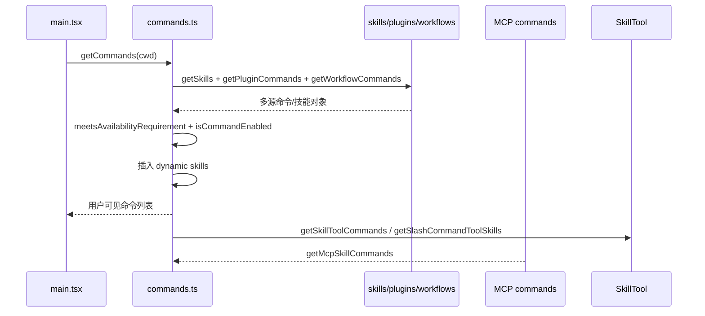

# 第 8 章 命令系统、技能与 MCP 扩展

> 对应源码主线：src/commands.ts，以及 main.tsx / tools.ts 中和 skills、MCP 相关的装配逻辑

## 8.1 命令系统不是附属 UI，而是能力分发层

在这个工程里，命令系统有两个常见误解：

1. 以为它只是 REPL 里输入 /xxx 的交互功能
2. 以为它和工具系统是完全平行的两套机制

实际上都不对。

命令系统同时承担：

- 面向用户的人类交互入口
- 面向模型的技能能力索引
- 面向插件和工作流的扩展注入点

所以它其实是一个“能力分发层”。

## 8.2 命令对象从哪里来

前面我们已经看过 loadAllCommands()：

```ts
return [
  ...bundledSkills,
  ...builtinPluginSkills,
  ...skillDirCommands,
  ...workflowCommands,
  ...pluginCommands,
  ...pluginSkills,
  ...COMMANDS(),
]
```

这意味着命令对象有多种来源：

1. 内建命令
2. bundled skills
3. 本地技能目录
4. workflow commands
5. 插件命令
6. 插件技能

所以命令系统本质上是一个动态装载系统，而不是硬编码列表。

## 8.3 为什么 getCommands() 还要插入 dynamic skills

getCommands() 在得到 baseCommands 之后，还会处理 dynamicSkills：

```ts
const dynamicSkills = getDynamicSkills()
...
const uniqueDynamicSkills = dynamicSkills.filter(
  s =>
    !baseCommandNames.has(s.name) &&
    meetsAvailabilityRequirement(s) &&
    isCommandEnabled(s),
)
```

这说明 skills 不是一次性静态发现完就结束了，运行过程中还可能产生新的动态能力项。

这里的设计重点是：

- 昂贵的命令源加载结果尽量缓存
- 轻量的动态发现结果可以叠加进来

这样既保住性能，又保住灵活性。

## 8.4 给模型用的技能索引，与给用户看的命令列表不同

commands.ts 中有两个很重要的函数：

### getSkillToolCommands(cwd)

用于构建 SkillTool 可见的 prompt 型命令集合。

### getSlashCommandToolSkills(cwd)

偏向筛选真正意义上的 skills。

它们都不是“把所有命令给模型”，而是按一套规则筛选：

- 必须是 prompt 类型
- 不能 disableModelInvocation
- 通常不能是 builtin source
- 通常需要 description 或 whenToUse

这说明：

模型可调用 skill 并不是“所有 slash command 的镜像”，而是被精细筛选过的一组 prompt 化能力。

## 8.5 skills 和 tools 的差异

这一点必须讲清楚：

### Tool

是结构化能力。模型通过 tool_use 发起，宿主程序执行，返回 tool_result。

### Skill

更像高层策略模板或能力包。它经常是 prompt 型能力，不一定直接映射为单次宿主操作。

所以可以把它们理解为：

- tool 是“手脚”
- skill 是“套路”

这也是为什么 SkillTool 需要单独索引和筛选。

## 8.6 MCP 在这套系统里不是单点接入，而是多层接入

MCP 在 Claude Code 里至少会接入三类东西：

1. MCP tools
2. MCP commands / skills
3. MCP resources

对应地，它们会进入不同运行层：

- tool 层：进入 assembleToolPool
- command/skill 层：进入命令系统索引
- resource 层：通过专门的 MCP resource tools 暴露

这意味着 MCP 并不是“外挂工具协议”，而是被真正纳入主能力框架中的扩展机制。

## 8.7 为什么命令系统和工具系统都要考虑 prompt cache 稳定性

前面在 tools.ts 里已经看到工具顺序会影响缓存。

命令系统也一样，因为：

- skill 列表会影响模型看到的能力描述
- 命令可见性变化会影响系统 prompt 或辅助上下文

所以这套工程里很多“排序、过滤、缓存”看起来像细枝末节，实际上都在服务于一个全局目标：

让能力集合既准确，又尽可能稳定。

## 8.8 main.tsx 为什么要在 getCommands() 之前先注册 bundled skills/plugins

grep 结果里有一个非常重要的注释位置：

- main.tsx 中在 kick getCommands() 之前先注册 bundled skills/plugins

这个顺序看似普通，实际上是在避免 race condition：

如果 getCommands() 先跑，而 bundled skills 还没注册完成，那么 memoized 结果里就会缺技能，后面会话就拿到一份错误的命令索引。

这就是大型动态装配系统常见的问题：

- 不是“有没有代码”
- 而是“缓存是在什么时点打下来的”

## 8.9 这一章的阅读结论

关于命令、技能和 MCP，这一章需要记住五件事：

1. 命令系统是动态能力分发层，不只是 slash UI。
2. skills 是高层能力模板，tools 是结构化执行能力。
3. 模型可见的 skills 集合经过专门筛选，不等于全部命令。
4. MCP 在这个工程里多层接入，不只是工具接入。
5. 动态装配系统最怕时序错误，因此注册、缓存、过滤的先后顺序非常关键。

下一章收尾，会把 memory、resume、工程化设计和后续精读路线串起来。

## 8.10 COMMANDS() 为什么声明成函数而不是常量

commands.ts 里有一句注释非常重要：

```ts
// Declared as a function so that we don't run this until getCommands is called,
// since underlying functions read from config, which can't be read at module initialization time
const COMMANDS = memoize((): Command[] => [ ... ])
```

这说明内建命令表并不是“模块加载时就固定下来”的纯静态数据。

作者刻意把它包成函数，是为了避免两个问题：

1. 模块初始化过早读取配置
2. 命令可见性在真正运行态尚未建立前就被冻结

也就是说，commands.ts 虽然看起来像声明式命令表，实际上仍然遵守“延迟装配”的原则。

## 8.11 getSkills() 的容错语义：技能加载失败不能拖垮整机

getSkills(cwd) 很值得单独看，因为它把几个技能来源并发读取后，又分别做了容错：

```ts
const [skillDirCommands, pluginSkills] = await Promise.all([
  getSkillDirCommands(cwd).catch(... => []),
  getPluginSkills().catch(... => []),
])
```

后面又补上：

- getBundledSkills()
- getBuiltinPluginSkillCommands()

这里的设计重点非常明确：

- skills 很重要
- 但 skills 不是系统存活前提

因此命令系统采用的是“局部降级、整体继续”的策略。

如果某个 skill 目录损坏、某个插件加载异常，Claude Code 不应该整机起不来，而应该只是少一部分扩展能力。

## 8.12 loadAllCommands() 才是命令装载的总汇合点

前面提到过 loadAllCommands()，但如果从函数级角度再看一次，会更清楚它的角色：

1. getSkills(cwd)
2. getPluginCommands()
3. getWorkflowCommands(cwd)
4. 最后再拼接 COMMANDS()

它返回顺序是：

```ts
return [
  ...bundledSkills,
  ...builtinPluginSkills,
  ...skillDirCommands,
  ...workflowCommands,
  ...pluginCommands,
  ...pluginSkills,
  ...COMMANDS(),
]
```

这个顺序不是随意的。

它本质上在表达一条能力汇合链：

- 先放技能和扩展命令
- 最后再接 builtin commands

后面 dynamic skills 的插入位置，也是建立在这个分层顺序之上的。

## 8.13 getCommands() 的函数级执行链

getCommands(cwd) 不是简单“load 然后 return”。

它的完整执行链可以拆成六步：

1. await loadAllCommands(cwd)
2. 获取运行期动态发现的 dynamicSkills
3. 对 allCommands 执行 meetsAvailabilityRequirement + isCommandEnabled
4. 如果没有 dynamic skills，直接返回 baseCommands
5. 对 dynamic skills 做去重与可用性过滤
6. 把 dynamic skills 插进 plugin skills 之后、builtin commands 之前

最关键的是第六步：

```ts
const builtInNames = new Set(COMMANDS().map((c) => c.name))
const insertIndex = baseCommands.findIndex((c) => builtInNames.has(c.name))
```

这说明 dynamic skills 不是简单 append，而是被放进命令索引的特定层位里。

这让最终列表仍然保持“扩展能力在前、内建命令在后”的结构。

## 8.14 meetsAvailabilityRequirement() 为什么不做缓存

源码注释已经明确写了：

- Not memoized — auth state can change mid-session

这点很重要，因为命令系统里至少有一部分命令受身份与 provider 状态影响，例如：

- claude-ai subscriber
- console API key 用户
- 是否使用第三方服务

如果把这层判断缓存死，那么：

- 用户刚执行 /login
- provider 环境刚切换

命令列表就会滞后。

所以 commands.ts 的策略非常一致：

- 昂贵的 I/O 装载做缓存
- 便宜但依赖运行态的过滤每次重算

这和前面 tools.ts 的思路完全一致。

## 8.15 getSkillToolCommands() 与 getSlashCommandToolSkills() 的边界

这两个函数容易混，但服务对象不同。

### getSkillToolCommands(cwd)

目标是给 SkillTool 提供“模型可调用的 prompt 型命令集合”。

筛选逻辑强调：

- `cmd.type === 'prompt'`
- `!cmd.disableModelInvocation`
- `cmd.source !== 'builtin'`
- 对 plugin/MCP 等来源，通常要求显式 description 或 whenToUse

所以它的边界是：

- 不要求这些命令都是“纯 skills”
- 但必须适合作为模型能力条目暴露出去

### getSlashCommandToolSkills(cwd)

目标更偏“技能清单”。

它会保留：

- loadedFrom 为 skills / plugin / bundled
- 或 disableModelInvocation 的特殊能力项

这意味着它更偏向“用于 slash command / skills 展示与归类”的技能视图。

简化理解：

- getSkillToolCommands 更偏模型调用视角
- getSlashCommandToolSkills 更偏技能分类视角

## 8.16 dynamic skills 为什么要单独插层

getDynamicSkills() 最大的意义，在于它证明命令系统不是“启动时发现一次就结束”。

动态技能通常来源于运行期文件操作、索引刷新或扩展发现。

如果把它们直接混进 loadAllCommands() 的 memoize 结果里，会有两个问题：

1. 每出现新动态技能都要打破整份缓存
2. 命令系统的“昂贵装载”和“轻量增量发现”被耦合在一起

现在的实现把它们拆开，相当于形成两层：

- 冷启动装载层
- 运行期增量插入层

这是一种很成熟的缓存分层策略。

## 8.17 clearCommandMemoizationCaches() 清的不是“全部缓存”

这段代码很值得学习，因为它专门强调了一件事：

- 清掉内层 memoization，不等于清掉外层 skill index cache

源码直接写到：

```ts
// getSkillIndex ... is a separate memoization layer built ON TOP of
// getSkillToolCommands/getCommands. Clearing only the inner caches is a no-op
// for the outer
```

这反映出一个大型动态系统常见的坑：

- 多层缓存叠在一起后，清缓存必须知道每一层在哪里

否则就会出现“明明 clear 了，为什么结果没变”的假象。

commands.ts 在这里把这个关系写得很透明，这一点很难得。

## 8.18 MCP 为什么不仅是 tool 扩展，还是 skill 扩展

getMcpSkillCommands(mcpCommands) 把 MCP-provided commands 进一步筛成：

- prompt 型
- loadedFrom === 'mcp'
- 可模型调用

也就是说，MCP 在这套架构里不只是给模型增加一把“执行工具”，还可以提供一套“prompt 型技能”。

这会带来一个非常重要的架构效果：

- 本地系统的扩展协议，不只扩执行面，也扩策略面

执行面是 tools。

策略面是 skills / prompt commands。

所以 MCP 真正接入的是 Claude Code 的能力分发层，而不是某个孤立子系统。

## 8.19 remote mode 与 bridge mode 的命令降权

commands.ts 后半段还有一条很容易被忽略的主线：

- REMOTE_SAFE_COMMANDS
- BRIDGE_SAFE_COMMANDS
- isBridgeSafeCommand()
- filterCommandsForRemoteMode()

这说明命令系统也和运行环境强相关。

在 remote / mobile / web bridge 这些场景里，命令不能默认全部开放，因为其中很多命令依赖：

- 本地文件系统
- 本地 Ink UI
- 本地终端副作用

因此这里做的不是“功能缺失”，而是运行环境降权。

这和 tools.ts 里按模式裁剪工具池，是同一种设计哲学。

## 8.20 命令、技能、工具三者并不是平行关系

读到这里，可以把三者关系总结得更准确一些：

### 命令

是能力入口的统一抽象，主要服务 REPL slash command、人类交互以及部分模型能力索引。

### 技能

是命令中的一个高层子集，更强调 prompt 化、策略化、可复用的能力模板。

### 工具

是结构化执行接口，负责真正把模型意图落到宿主动作上。

因此它们不是三套孤立机制，而是一条逐层收敛的链：

- 命令系统做能力编目
- 技能系统做高层能力表达
- 工具系统做宿主执行落地

## 8.21 这一章最值得记住的装配图

## 8.22 这一章和后续章节怎么衔接

第 8 章的作用，是把“能力索引”这一层真正讲透。

1. 它承接第 2 章和第 7 章，因为前面已经分别从入口装配和工具边界两侧看到命令系统的一部分，这一章才把 commands、skills、MCP commands 统一成完整能力分发层。
2. 它会回流到第 15 章和第 16 章，因为子代理自己的 commands/agents 装配，以及 MCP skill/resource/tool 接入，实际上都在复用这里建立的命令索引思路。
3. 它也会影响第 20 章，因为 remote/bridge 模式下命令降权、slash command 裁剪和能力可见性，最后仍然站在这一章定义的命令分层之上。

所以第 8 章不能只当成“命令专题”看，它其实是在解释统一运行时怎样把人类命令、模型技能和协议接入能力收敛成同一套索引面。



这一章读完，应该建立一个更稳固的认识：

- commands.ts 不是 REPL 的附属模块，而是扩展能力的主索引层
- skills 是命令体系中专门面向模型复用的一层高阶能力
- MCP 并不是外挂，而是直接插进命令、技能、工具三条能力链中的扩展协议
