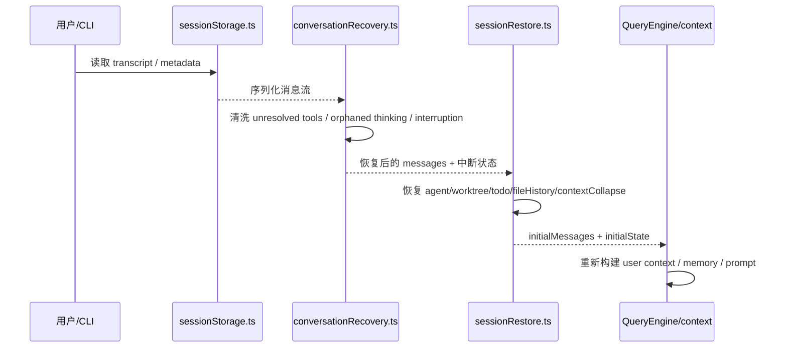

# 第 9 章 记忆、会话恢复与工程化设计

> 对应源码主线：docs/context/project-memory.mdx，以及 main.tsx、QueryEngine.ts、setup.ts 中相关工程化逻辑

## 9.1 记忆系统为什么重要

如果只有本轮上下文，Claude Code 只是一个“强一点的多轮工具调用器”。

而项目记忆和会话恢复让它更像真正的长期协作 Agent。

它们分别解决两个不同问题：

1. memory：跨会话保留长期知识
2. resume / transcript：恢复具体会话轨迹

这两者不能混为一谈。

## 9.2 project memory 的设计核心：文件系统优先

根据 docs/context/project-memory.mdx，这套记忆系统不是数据库，也不是向量库，而是文件系统结构化存储。

核心特征包括：

- 入口索引是 MEMORY.md
- 记忆文件按类型组织
- 召回基于轻量筛选，不是全量硬塞
- 保存的是“代码里推不出来，但对未来仍有价值的信息”

这种设计的优点很明显：

1. 可读可改
2. 容易审计
3. 与仓库/工作目录心智一致
4. 不需要额外基础设施

这非常符合 CLI Agent 的产品形态。

## 9.3 为什么 memory 不等于 CLAUDE.md

这两个东西容易混，但定位不同：

### CLAUDE.md

更像项目显式说明书，是仓库内公开约定。

### Memory

更像长期协作知识沉淀，保存的是使用过程中逐渐发现的稳定事实。

比如：

- 用户对改动风格的稳定偏好
- 项目里某个流程性的隐藏约束
- 某条排障经验或工具使用禁忌

所以 Memory 是“经验记忆”，CLAUDE.md 是“项目说明”。

## 9.4 QueryEngine 与 session persistence 的关系

虽然 QueryEngine 维护 mutableMessages，但会话持久化本身并不等于 QueryEngine。

原因是：

- QueryEngine 关心的是会话运行态
- session persistence 关心的是磁盘上的 transcript 与恢复流程

这也是为什么 main.tsx、sessionStorage、conversationRecovery 等模块会参与 resume 路径。

换句话说：

- QueryEngine 负责“现在怎么跑”
- session 工程层负责“下次怎么接着跑”

## 9.5 这个项目非常重视工程化细节

精读下来会发现，这个项目和普通 demo agent 的最大差别，不是工具数量，而是工程化意识。

具体体现在：

### 启动性能

- 入口 fast-path
- 并行预取
- 首屏后 deferred prefetch

### 缓存稳定性

- system prompt 静动态拆分
- tool pool 排序稳定
- command/skill 加载 memoize

### 安全边界

- trust dialog
- permission mode
- deny rule 前置过滤
- 设置源限制

### 扩展能力

- skills
- plugins
- MCP
- worktree
- daemon / bridge / remote

### 运行恢复

- transcript
- resume
- compact
- fallback
- max_output_tokens / PTL recovery

这些能力加在一起，才让系统从“功能能跑”走向“可以长期使用”。

## 9.6 如何继续深入精读

如果你接下来还要继续深入源码，可以按三条线扩展：

### 路线一：沿着 UI 往下深挖

继续读：

- screens/REPL.tsx
- components/App.js
- state/AppStateStore.js
- hooks/\*

适合关心终端交互体验、输入系统、状态联动的人。

### 路线二：沿着工具执行链往下深挖

继续读：

- Tool.ts
- services/tools/toolOrchestration.ts
- services/tools/StreamingToolExecutor.ts
- 各个具体 Tool 实现

适合关心 Agent 实际执行和权限控制的人。

### 路线三：沿着模型接入与压缩系统往下深挖

继续读：

- services/api/\*
- services/compact/\*
- utils/messages.ts
- utils/api.ts

适合关心上下文窗口、流式协议、缓存和成本控制的人。

## 9.7 全书总结

到这里，应该可以把 Claude Code 的主干结构概括为一句话：

这是一个以 main.tsx 为运行时装配中心、以 QueryEngine 为会话编排中心、以 query.ts 为智能体循环中心、以 tools/commands/context 为能力与知识输入层的大型 CLI Agent 工程。

更具体一点说，它解决了 Agent 系统中的五个根问题：

1. 怎么启动与装配
2. 怎么建立会话与上下文
3. 怎么循环调用模型与工具
4. 怎么安全地暴露能力边界
5. 怎么跨会话沉淀与恢复

这也是为什么它适合做源码精读教材：

- 主链路清晰
- 模块分层明确
- 工程细节丰富
- 设计取舍有大量注释可考证

如果你要继续写更细的教程，最值得深挖的两个点是：

1. QueryEngine 与 REPL 的状态交互细节
2. query.ts 中 compact / fallback / stop hook / tool execution 的真实执行时序

这两部分会决定你最终能不能真正读懂这个工程的“灵魂”。

## 9.8 memory 真正进入上下文的入口，不在 docs，而在 context.ts

前面讲 project memory 时，如果只看文档，很容易把它理解成一个“概念系统”。

但从源码执行链看，它真正落到会话里的关键入口，是 context.ts 里的 getUserContext()：

```ts
const claudeMd = shouldDisableClaudeMd ? null : getClaudeMds(filterInjectedMemoryFiles(await getMemoryFiles()))
```

这段逻辑说明两件事：

1. memory 文件并不是独立注入一份平行 prompt
2. 它会先经过 getMemoryFiles() 与 filterInjectedMemoryFiles()，再并入 CLAUDE.md 体系

也就是说，对主会话而言，“项目说明 + 记忆文件”最后共同汇入 user context，而不是各走一套完全独立的上下文通道。

## 9.9 为什么 getUserContext() 要把记忆和日期一起缓存

getUserContext() 返回的其实只有两类东西：

- claudeMd
- currentDate

这看似简单，但设计上非常有意思。

因为作者把“长期项目知识”和“会话发生时间”都放进了同一个 memoized user context 里。

这样做有两个结果：

1. 一次会话里，memory/CLAUDE.md 不会频繁抖动
2. currentDate 在同一会话里也保持稳定，不会因为跨午夜导致 prompt cache 前缀变化

所以这里的缓存价值不只是省 I/O，更是稳定会话语义。

## 9.10 loadMemoryPrompt() 说明 memory 还有第二条注入链

除了 getUserContext() 这条“文件并入用户上下文”的链路，QueryEngine.ts 还引入了另一条和 memory 相关的能力：

```ts
import { loadMemoryPrompt } from './memdir/memdir.js'
```

再结合 docs/context/project-memory.mdx 可以看到，memdir 系统并不只是“扫描文件然后拼进来”，而是有完整的：

- MEMORY.md 入口索引
- 四类型记忆分类
- Sonnet 侧相关记忆筛选
- KAIROS 日志模式

这说明 Claude Code 的 memory 体系至少分成两层：

### 第一层：静态项目知识层

通过 CLAUDE.md 与 memory files 进入 user context。

### 第二层：自动记忆机制层

通过 memdir/memory prompt 机制，让系统知道如何读写、筛选和维护长期记忆。

这比“把几份 Markdown 一起拼接”要完整得多。

## 9.11 history.ts 记录的不是 transcript，而是输入历史

history.ts 很容易和 session transcript 混淆，但它们解决的问题不同。

history.ts 管的是：

- 上下箭头历史
- ctrl+r 搜索
- pasted text/image 引用恢复

它记录的是 prompt history，而不是整轮对话 transcript。

这从几个函数就能看出来：

- getHistory()
- getTimestampedHistory()
- expandPastedTextRefs()
- addToPromptHistory()

尤其是它会把 pasted content 单独存储，大内容走 hash 引用，小内容走 inline content，这说明它优化的是“用户输入体验”，而不是会话恢复本身。

## 9.12 history.ts 的工程亮点：异步写入 + 锁文件 + 当前会话优先

history.ts 很值得精读的点，在于它不是随手 append 一行历史，而是专门处理了几个工程问题：

### 当前会话优先

getHistory() 会先返回当前 session 的输入历史，再返回其他 session 的历史，避免多会话并发时上箭头记录互相打乱。

### 写入去抖和重试

pendingEntries、flushPromptHistory()、immediateFlushHistory() 形成了一套异步刷盘机制，避免每次输入都同步写文件。

### 文件锁

写 `history.jsonl` 前会先 lock，避免并发进程互相覆盖。

所以 history.ts 体现的不是“功能很多”，而是一个长期运行 CLI 应有的输入历史工程化。

## 9.13 sessionStorage.ts 才是 transcript persistence 的主仓库

如果说 history.ts 是输入历史，那么 sessionStorage.ts 才是正式会话持久化的核心。

这个文件最值得先建立的认识有三个：

1. transcript 存的是 JSONL
2. transcript path 与 sessionId、projectDir 强绑定
3. parentUuid chain 是恢复会话结构的关键索引

像下面这些函数，基本就定义了 transcript 子系统的主轮廓：

- getTranscriptPath()
- getTranscriptPathForSession()
- isTranscriptMessage()
- isChainParticipant()
- loadTranscriptFile()
- recordTranscript()

它不是简单日志，而是“可恢复的会话事件流”。

## 9.14 为什么 sessionStorage.ts 要专门区分 transcript message 和 progress message

sessionStorage.ts 里有一段非常关键的注释：

- Progress messages are NOT transcript messages.

对应的判断是：

```ts
export function isTranscriptMessage(entry: Entry): entry is TranscriptMessage {
  return entry.type === 'user' || entry.type === 'assistant' || entry.type === 'attachment' || entry.type === 'system'
}
```

这一步非常重要，因为 progress 是 UI 态，不是会话语义本身。

如果把 progress 也混入 parentUuid 链里，恢复时就会出现链分叉、消息孤儿化等问题。

这正是工程代码和 demo 代码的区别：

- demo 往往只会“先记下来再说”
- 工程系统会先定义“什么东西有资格进入正式会话记录”

## 9.15 deserializeMessagesWithInterruptDetection() 说明 resume 不是简单读文件

conversationRecovery.ts 里的 deserializeMessagesWithInterruptDetection()，是整条恢复链里最值得反复看的函数之一。

它做的事情远不只是“把 JSON 读回来”：

1. 迁移旧 attachment 类型
2. 清洗非法 permissionMode
3. 过滤 unresolved tool uses
4. 过滤 orphaned thinking-only assistant messages
5. 过滤纯空白 assistant 消息
6. 检测会话是否中断在半轮中
7. 必要时补一条 synthetic continuation user message
8. 如果最后一条是 user，再补一个 synthetic assistant sentinel

这说明 resume 的真正难点不是 I/O，而是“把历史脏数据重组成 API 与 REPL 都还能接受的规范会话链”。

## 9.16 interrupted turn 为什么会被改写成“Continue from where you left off.”

conversationRecovery.ts 里有个很妙的处理：

如果检测到会话中断在半轮里，并不会把这种状态原样抛给上层，而是把它统一改写成：

- interrupted_prompt
- 外加一条 meta user message：`Continue from where you left off.`

这样做的好处是，上层消费 resume 结果时就不用分裂成多套逻辑：

- 一套处理普通用户下一条输入
- 一套处理中途中断恢复

现在两者被统一成了“下一条待提交用户消息”。

这是很典型的工程抽象：

- 复杂性留在恢复层
- 上层只看到统一接口

## 9.17 processResumedConversation() 才是“恢复结果重新接回运行态”的总装配点

sessionRestore.ts 里的 processResumedConversation()，作用非常像“resume 版的 main 装配器”。

它会依次处理：

1. 匹配 coordinator/normal mode
2. 决定是否复用原 sessionId，或 fork 成新 session
3. switchSession(...) 切换到被恢复的 session/projectDir
4. resetSessionFilePointer() / adoptResumedSessionFile()
5. restoreSessionMetadata(...)
6. restoreWorktreeForResume(...)
7. restore context-collapse 状态
8. restoreAgentFromSession(...)
9. 重新计算 initialState 并返回给 REPL / CLI

也就是说，恢复不是“读出 messages 然后塞回去”，而是要把整个会话现场一并恢复。

## 9.18 restoreSessionStateFromLog() 恢复的不是消息，而是运行副状态

sessionRestore.ts 里另一个关键函数是 restoreSessionStateFromLog()。

它恢复的是那些“不在主消息数组里，但又决定运行体验”的状态，例如：

- file history snapshots
- attribution state
- context collapse entries
- TodoWrite 产生的 todo state

这很重要，因为 message transcript 只能恢复“说了什么、做了什么”，但不能完整恢复“界面和运行时内部现在应该长什么样”。

因此 resume 在这个项目里至少包含两类恢复：

### 消息恢复

把 transcript 重新串成有效会话。

### 状态恢复

把 file history、todo、collapse、agent、worktree 等运行副状态重新挂回 AppState 和 bootstrap state。

## 9.19 worktree resume 是这个工程很容易被低估的一层复杂度

sessionRestore.ts 里 restoreWorktreeForResume() 与 exitRestoredWorktree() 说明，resume 不只恢复对话，还可能恢复 cwd。

这意味着 Claude Code 恢复的不是“抽象会话”，而是“落在某个具体工作树上的会话现场”。

它甚至还要处理：

- worktree 目录已经不存在
- 当前启动又新建了 fresh worktree
- 中途 /resume 从一个 worktree session 切到另一个 session

这些逻辑说明这个工程把“会话”和“工作目录现场”绑定得非常深。

## 9.20 第 9 章真正应该收住的，不是总结，而是工程分层

到这里，可以把这一章收束成更清晰的三层：

### 长期知识层

CLAUDE.md、memory files、memdir 自动记忆系统，负责跨会话保留知识。

### 输入历史层

history.ts 负责用户 prompt 历史与 pasted content 引用恢复。

### 会话恢复层

sessionStorage、conversationRecovery、sessionRestore 共同负责 transcript 持久化、清洗、恢复与重新装配。

这三层一起，才构成了 Claude Code 的“长期可用性”。

## 9.21 这一章最值得记住的恢复链路图



读完这一章之后，应该形成一个非常明确的判断：

- Claude Code 的“记忆”不是单一机制
- 它至少同时包含知识记忆、输入历史、会话恢复三种持久化层
- 真正让这个系统适合长期使用的，不是某一个工具或某一句 prompt，而是这一整套持久化与恢复工程
