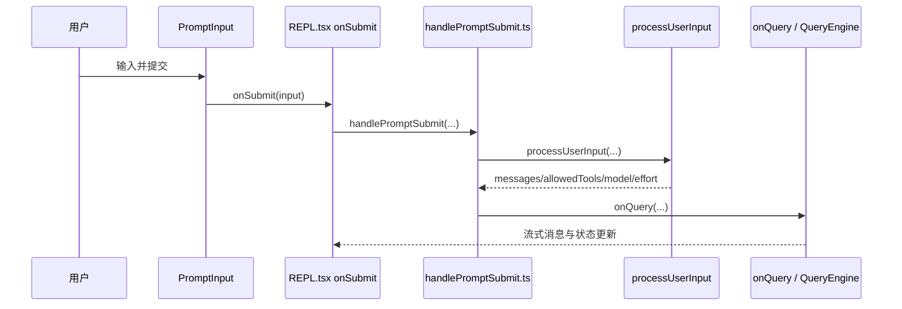
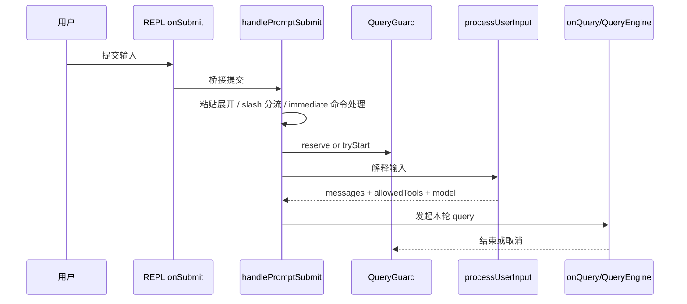

# 第 10 章 REPL 交互层与输入提交流程

> 对应源码主线：src/screens/REPL.tsx、src/utils/handlePromptSubmit.ts、src/replLauncher.tsx、src/interactiveHelpers.tsx

## 10.1 为什么 REPL.tsx 会这么大

REPL.tsx 的体量很大，不是因为“界面写乱了”，而是因为它承担了终端 Agent 的交互控制台职责。

它同时要管理：

- 输入框与 typeahead
- slash commands
- tools / commands / MCP / plugins 的实时合并
- dialogs 与 notifications
- loading / abort / queue / pending prompt 等交互状态
- transcript 模式、scroll、fullscreen、message actions
- remote / bridge / mailbox / teammate 等异步输入来源

所以 REPL.tsx 更像“交互 shell 宿主”，不只是一个展示组件。

用全书术语来说，这一章讲的是统一运行时在终端里的交互壳，以及会话编排层进入 UI 之前的最后一层桥接。

## 10.2 REPL 先做的不是渲染，而是把能力和状态拼起来

在进入真正输入链路之前，REPL 会先把会话态的 commands 和 tools 装起来。

例如：

```ts
const localTools = useMemo(() => getTools(toolPermissionContext), [toolPermissionContext, proactiveActive, isBriefOnly])
const mergedTools = useMergedTools(combinedInitialTools, mcp.tools, toolPermissionContext)
```

以及：

```ts
const commandsWithPlugins = useMergedCommands(localCommands, plugins.commands as Command[])
const mergedCommands = useMergedCommands(commandsWithPlugins, mcp.commands as Command[])
const commands = useMemo(() => (disableSlashCommands ? [] : mergedCommands), [disableSlashCommands, mergedCommands])
```

这说明 REPL 层不是被动拿一份固定能力表，而是实时从 AppState、MCP、plugins、permissionContext 重新拼出当前交互态下真正可用的能力集合。

## 10.3 getToolUseContext() 是 REPL 层给 query/工具层开的总接口

REPL.tsx 里一个非常关键的函数是 getToolUseContext()。

它会返回一大坨 processUserInput / tool execution 所需的上下文，包括：

- 当前 commands
- 当前 tools
- 当前 mainLoopModel / thinkingConfig
- mcpClients / mcpResources
- getAppState / setAppState
- readFileState
- appendSystemMessage
- addNotification
- onInstallIDEExtension

也就是说，REPL 层向下游暴露的不是几个零散参数，而是一整个“当前交互世界”的接口对象。

这正是大型 React 应用里常见的模式：

- UI 层聚合状态
- 下游执行逻辑通过上下文对象读取与回写

## 10.4 输入真正开始处理的地方：onSubmit

REPL.tsx 中真正关键的输入入口是 onSubmit。

这个函数不是直接调 QueryEngine，而是先处理一堆交互层责任：

- 输入暂存与还原
- slash command / queued input / speculation accept 相关处理
- 输入加入 history
- repin scroll / fullscreen / stash 恢复
- 然后再调用 handlePromptSubmit()

因此 onSubmit 是“交互层提交入口”，不是“执行层入口”。

## 10.5 handlePromptSubmit() 才是 UI 到执行链的桥

真正把用户输入推进到 processUserInput 和 onQuery 的，是 handlePromptSubmit()。

从源码看，它做了几件关键事：

1. 先 reserve queryGuard，防止并发提交穿透
2. 调 processUserInput()，把输入解释成 messages、allowedTools、model、effort 等执行参数
3. 必要时做 fileHistory snapshot
4. 如果有新消息，就调用 onQuery(...)
5. 如果只是本地 slash command，没有消息落盘，就清理 toolJSX、释放 reservation

这说明 handlePromptSubmit 是从“输入解释”切到“实际执行”的桥梁。

## 10.6 queryGuard 解决的是交互并发问题

REPL 层有一个很重要的状态机：queryGuard。

源码注释已经讲得很明确：它是为了解决过去 isLoading 和 isQueryRunning 分离带来的竞态问题。

它的职责包括：

- reserve：在 processUserInput 之前先锁住本轮提交
- tryStart：真正进入执行态
- end：执行完成
- cancelReservation：失败或未进入执行时释放保留位

这个状态机为什么放在 REPL 层而不是 QueryEngine 层？

因为它解决的是“用户交互并发”而不是“模型执行并发”。

## 10.7 REPL 层为什么要维护自己的 loading state

REPL.tsx 中的 isLoading 不是单纯来自 query，它还会综合：

- 本地 queryGuard 的状态
- remote session / background task 的外部 loading

也就是说，UI 关心的是“这个控制台此刻是不是忙”，而不只是“当前本地 query 是否正在流式返回”。

这再次说明 REPL 层有独立于 QueryEngine 的交互状态机。

`handlePromptSubmit()` 的入口骨架本身就能说明它为什么是“桥接器”而不是“直接发 query”：

```ts
if (queuedCommands?.length) {
    await executeUserInput({ ... })
    return
}

const finalInput = expandPastedTextRefs(input, pastedContents)

if (!skipSlashCommands && finalInput.trim().startsWith('/')) {
    ...
}

if (queryGuard.isActive || isExternalLoading) {
    enqueue({ value: finalInput.trim(), ... })
    return
}

await executeUserInput({
    queuedCommands: [cmd],
    ...
})
```

这段代码清楚地说明了四层分流：先处理队列路径，再做 pasted refs 展开，再判断是否命中本地即时命令，最后才根据 queryGuard / external loading 决定是入队还是执行。也就是说，handlePromptSubmit() 吃掉了大量交互语义，真正落到 QueryEngine 的只是清洗后的执行请求。

## 10.8 输入链的完整路径

把 REPL 输入链压缩成一条路径，可以记成下面这样：



这条链路非常重要，因为它解释了：

- 用户输入并不是直接进入 query.ts
- 中间必须先经过 UI 层的交互状态管理
- 再经过输入解释层
- 最后才进入执行链

## 10.9 这一章的阅读结论

理解 REPL 层要抓住四点：

1. REPL.tsx 是终端 Agent 的交互控制台，不是普通展示组件。
2. onSubmit 管交互层提交语义，handlePromptSubmit 管输入到执行层的桥接。
3. queryGuard 解决的是用户交互并发，不是模型侧并发。
4. REPL 层本身也是一个状态机密集区，不能把它误看成“QueryEngine 的壳”。

## 10.10 REPL 的真正起点：先把“当前交互世界”装起来

如果只看 onSubmit，很容易忽略 REPL 在那之前已经做了大量装配工作。

从源码可以看到，REPL.tsx 在渲染期就不断合成：

- mergedTools
- mergedCommands
- mcpClients
- AppState
- queryGuard
- file state cache
- notifications / dialogs / remote session state

因此 REPL 不是“等输入来了再组织参数”，而是始终维护一份可提交的当前交互世界。

这也是为什么 getToolUseContext() 会显得很大，因为它拿到的不是零散局部状态，而是这整份交互世界的快照接口。

## 10.11 onSubmit 的函数级职责分层

用户按下回车后，REPL 的 onSubmit 实际上会先做一系列纯 UI / 交互语义处理，再进入执行层。

这一层典型负责的是：

1. 处理输入框内容与 cursor/buffer
2. 处理 slash command、queued input、speculation accept 等交互分支
3. 写入输入历史、repin scroll、退出 transcript/fullscreen 的局部状态
4. 最后才把任务交给 handlePromptSubmit()

所以 onSubmit 最适合被理解成：

- 交互层提交协调器

而不是“发起 query 的地方”。

## 10.12 handlePromptSubmit() 的第一层分流：队列路径和直接输入路径

handlePromptSubmit() 一进来做的第一件事，就是区分：

- queuedCommands 路径
- 普通用户输入路径

源码里非常明确：

```ts
if (queuedCommands?.length) {
    await executeUserInput(...)
    return
}
```

这说明同一个提交桥接器要同时服务两类来源：

1. 用户当前输入
2. 之前排队等待执行的命令

因此 handlePromptSubmit() 不只是“处理 input string”，还是队列执行入口。

## 10.13 handlePromptSubmit() 的第二层分流：输入清洗和即时命令

普通输入路径下，它会继续做两步非常关键的前置处理：

### 第一步：粘贴引用展开

```ts
const finalInput = expandPastedTextRefs(input, pastedContents)
```

也就是说，用户看到的 `[Pasted text #1]` 并不是最终送进执行链的文本，真正执行前会展开成原始内容。

### 第二步：local-jsx immediate command 直接处理

如果输入以 `/` 开头，且命中了 immediate local-jsx command，那么不会走普通 query 流程，而会直接装配本地 JSX 命令界面。

这说明 handlePromptSubmit() 还是命令分发器的一部分，而不是纯 query 适配器。

## 10.14 QueryGuard 的三态机，比布尔值重要得多

QueryGuard.ts 很短，但非常关键。

它不是简单的 `isRunning: boolean`，而是三态：

- idle
- dispatching
- running

这条状态链解决的是一个实际竞态：

- 队列里刚 dequeue 一项
- 还没真正进入 onQuery
- 但如果此时只看 `isRunning=false`，新的提交又会穿透进来

因此它专门引入了 dispatching 这个中间态，把“已经保留但尚未真正启动”的时间窗也盖住了。

这比传统 loading 布尔值严谨得多。

把 `QueryGuard` 的核心方法并排看，会更容易理解它为什么必须是三态机：

```ts
reserve(): boolean {
    if (this._status !== 'idle') return false
    this._status = 'dispatching'
    return true
}

tryStart(): number | null {
    if (this._status === 'running') return null
    this._status = 'running'
    ++this._generation
    return this._generation
}

end(generation: number): boolean {
    if (this._generation !== generation) return false
    if (this._status !== 'running') return false
    this._status = 'idle'
    return true
}
```

这里最重要的不是 `idle -> running`，而是中间专门插了一个 `dispatching`。这正是在堵住“队列刚 dequeue、异步链还没真正进入 onQuery、但新的提交已经又来了”的时间窗。第 10 章如果只把它理解成 loading flag，就会低估 REPL 层的并发治理复杂度。

## 10.15 QueryGuard 的函数级执行链

如果把 QueryGuard 的方法连起来看，它形成了一个很清晰的生命周期：

1. `reserve()`：队列准备处理，idle -> dispatching
2. `tryStart()`：真正启动执行，dispatching/idle -> running
3. `end(generation)`：当前代执行正常结束，running -> idle
4. `cancelReservation()`：预留位未真正启动，dispatching -> idle
5. `forceEnd()`：强制终止当前代，并推进 generation

这里最重要的是 generation。

它能防止旧查询 finally 块在新查询已经启动之后又回来错误清理状态。

也就是说，QueryGuard 不只是防重入，还是防“过期清理”。

## 10.16 handlePromptSubmit() 为什么要在桥接层处理排队与中断

handlePromptSubmit() 里有一条很重要的判断：

- 如果 `queryGuard.isActive || isExternalLoading`，新的输入不一定立即执行

这时它会根据输入模式、是否可中断、是否是 bash/prompt 等规则，决定：

- 直接返回
- 入队等待
- 或触发对当前回合的中断

这说明“队列语义”和“中断语义”都被放在 REPL 桥接层，而不是放到 QueryEngine 里。

原因也很明确：

- 这是交互策略
- 不是模型执行策略

## 10.17 executeUserInput() / processUserInput() / onQuery() 的接缝

从 REPL 到 QueryEngine 之间，真正关键的接缝是这样一条链：

1. `handlePromptSubmit()` 做输入清洗、模式分流、并发防护
2. `executeUserInput()` 组织本次执行参数
3. `processUserInput()` 把输入解释成 messages、allowedTools、model、effort
4. 如有需要先做 fileHistory snapshot
5. 再调用 `onQuery(...)`

也就是说，REPL 和 QueryEngine 之间并不是“直接把字符串扔进去”，而是隔着一个明确的输入解释层。

而 `handlePromptSubmit()` 真正推进到执行层时，调用链会落到 `executeUserInput() -> processUserInput() -> onQuery()`。这也是为什么它在桥接层就要先做下面这些事：

```ts
const finalInput = expandPastedTextRefs(input, pastedContents)

enqueue({
  value: finalInput.trim(),
  preExpansionValue: input.trim(),
  mode,
  pastedContents: hasImages ? pastedContents : undefined,
  skipSlashCommands,
  uuid,
})
```

这里保留了 `preExpansionValue` 和展开后的 `value` 两套表示，说明 REPL 桥接层同时关心“用户最初输入了什么”和“执行链最终应该看到什么”。这类双表示设计，正是终端 Agent 在交互壳层经常会出现、但在普通聊天 UI 里很少出现的复杂度来源。

这让很多交互层概念都可以在进入 query 之前就被吃掉，例如：

- 本地 slash command
- pasted text reference
- queued input
- immediate JSX command

## 10.18 这一章最值得记住的提交链图



理解完这条链，再回头看 REPL.tsx，就不会再觉得它“只是 UI 文件太大”，而会看到它其实是在托管整个终端交互状态机。

## 10.19 这一章和后续章节怎么衔接

第 10 章在前后文之间的桥接作用非常强：

1. 它承接第 5 章的 QueryEngine 会话编排，把会话编排层真正接到用户可见的提交链上。
2. 它和第 7 章工具系统形成配对关系，因为 REPL 在渲染期不断重新拼接当前 commands、tools、MCP 和 permissionContext。
3. 它直接铺到第 17 章和第 20 章，因为后面讲的后台任务导航、teammate 视图、remote session、bridge 输入注入，最后都要落回这一层交互壳。

所以 REPL.tsx 虽然是 UI 文件，但在这本书的叙事里，它其实是统一运行时对外暴露交互语义的总接缝。
