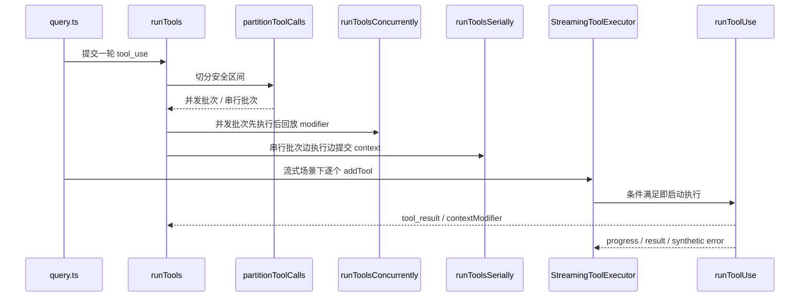

# 第 11 章 工具执行器与并发控制

> 对应源码主线：src/services/tools/toolOrchestration.ts、src/services/tools/StreamingToolExecutor.ts

## 11.1 工具执行并不是“遍历 tool_use 然后依次调用”

Claude Code 的工具执行层真正复杂的地方，在于它要同时满足三件事：

1. 尽量并发，提高效率
2. 保证上下文修改顺序正确
3. 保证消息轨迹顺序和一致性正确

这三者往往相互冲突，所以工具执行器必须专门设计。

## 11.2 runTools() 的总体策略：先分批，再分并发/串行

toolOrchestration.ts 里的 runTools() 是传统批处理入口。

它不会直接把所有 tool_use 一起丢出去，而是先调用 partitionToolCalls()：

```ts
for (const { isConcurrencySafe, blocks } of partitionToolCalls(
  toolUseMessages,
  currentContext,
)) {
  ...
}
```

partition 的结果只有两种批次：

1. 单个非并发安全工具
2. 多个连续的并发安全工具

这说明工具编排的第一原则是：并发只能发生在明确安全的局部区间里。

## 11.3 并发安全不是工具名决定的，而是输入决定的

partitionToolCalls() 的判断逻辑很值得注意：

```ts
const parsedInput = tool?.inputSchema.safeParse(toolUse.input)
const isConcurrencySafe = parsedInput?.success ? Boolean(tool?.isConcurrencySafe(parsedInput.data)) : false
```

也就是说：

- 并发安全性不是写死在工具类型上
- 而是“某个具体输入下，这次调用是否允许并发”

这比简单的工具级布尔值更精细，因为有些工具可能在只读输入下可并发，在会写状态的输入下不可并发。

## 11.4 为什么并发批次结束后还要回放 contextModifier

runTools() 在并发路径里有一个关键设计：先收集 contextModifier，再按原顺序统一应用。

这段逻辑说明一个核心原则：

- 消息结果可以并发产生
- 上下文修改不能乱序落地

也就是说，Claude Code 在工具层显式区分了两种结果：

1. 可立刻回传给消息流的输出
2. 必须按顺序作用于 ToolUseContext 的上下文变更

这正是“并发执行”和“语义一致性”同时成立的关键。

## 11.5 runToolsSerially() 的职责不是简单保守，而是保护上下文因果关系

对非并发安全工具，系统进入 runToolsSerially()。

它的核心不是“性能差一些”，而是：

- 每个工具执行后马上应用上下文变更
- 下一个工具看到的是已经更新后的 currentContext

这对于 Bash、FileEdit、Write、某些外部副作用工具尤其重要，因为这些工具的后一个调用往往依赖前一个调用刚刚造成的世界状态变化。

## 11.6 StreamingToolExecutor 解决的是“边出 tool_use 边执行”

StreamingToolExecutor 是另一种形态：

- 模型流式输出还没结束
- tool_use 已经出现
- 可以先把工具排队甚至直接开跑

这和 runTools 的差别非常本质：

- runTools 假设 tool_use 集合已经完整拿到
- StreamingToolExecutor 处理的是流式到达的 tool_use 序列

因此，它更像一个在线调度器，而不是离线批处理器。

## 11.7 StreamingToolExecutor 的内部状态

这个类维护的核心状态包括：

- tools：TrackedTool 队列
- toolUseContext
- hasErrored / erroredToolDescription
- siblingAbortController
- discarded

TrackedTool 里又保存：

- block
- assistantMessage
- status
- isConcurrencySafe
- results
- pendingProgress
- contextModifiers

也就是说，StreamingToolExecutor 不是简单地“立刻执行”，而是自己维护一套小型执行状态机。

## 11.8 sibling abort 的意义：一处失败，尽快收束同批并行工具

StreamingToolExecutor 里最有代表性的工程设计，是 siblingAbortController。

它的目标不是中止整轮 query，而是：

- 某个并行工具出错时
- 让同批兄弟工具尽快停掉
- 避免它们继续白白占用资源

这说明工具执行器本身也有“局部失败隔离 + 快速收束”的能力，而不是把所有错误都丢给上层处理。

## 11.9 synthetic error message 为什么这么重要

无论在 StreamingToolExecutor 还是 query.ts 中，一个反复出现的概念都是 synthetic error message。

它解决的是：

- 工具没有正常完成
- 但对话轨迹里必须给模型一个明确的 tool_result

StreamingToolExecutor 中典型的原因包括：

- sibling_error
- user_interrupted
- streaming_fallback

只有把这些异常都折叠成明确的 tool_result 错误块，后续模型才能在下一轮“知道刚才发生了什么”。

## 11.10 为什么最终结果要按接收顺序回放

即使工具是并发执行的，Claude Code 仍然非常在意结果输出顺序。

原因不是 UI 美观，而是对话语义稳定性。

模型看到的 assistant tool_use 顺序，和随后得到的 tool_result 顺序，最好保持可预测。

否则就会出现：

- 第 3 个工具先返回
- 第 1 个工具后返回
- 模型上下文难以稳定推理谁先谁后

因此系统要在“并发执行”与“顺序呈现”之间做平衡。

## 11.11 这一章的阅读结论

工具执行层的关键，不是“能调用工具”，而是：

1. 哪些调用可以并发
2. 并发时如何保证上下文变更有序
3. 错误和中断时如何补齐 tool_result
4. 如何把工具执行流和消息流重新对齐

这也是 Agent 工程里最容易被低估的一层，因为它看起来像“实现细节”，实际上决定了整套系统的正确性与效率。

## 11.12 runTools() 的函数级执行链

把 runTools() 拉直之后，可以更清楚地看到它的四段式结构：

1. 维护 `currentContext`
2. 用 `partitionToolCalls()` 把一轮 tool_use 切成批次
3. 对并发安全批次走 `runToolsConcurrently()`
4. 对非并发安全批次走 `runToolsSerially()`

也就是说，runTools() 自己其实不是执行器，而是：

- 批次调度器
- 上下文提交协调器

## 11.13 partitionToolCalls() 的真正语义：把“工具序列”切成“语义安全区间”

partitionToolCalls() 看起来只是 reduce 一下数组，但它干的是更重要的事情：

- 根据每个 tool_use 在当前输入下是否 concurrency-safe
- 切出一段一段安全区间

最终得到的不是“工具列表”，而是：

- 一串可以并发的区间
- 被单个独占工具隔开的边界点

这使后续调度不需要再每次重新推理全局依赖图，而是只需按区间执行。

## 11.14 runToolsConcurrently() 为什么还能保证最终语义稳定

并发批次内部，工具确实是一起跑的。

但 runTools() 不会立即把 contextModifier 落到 currentContext，而是：

1. 先实时把 message 往外 yield
2. 把每个 toolUseID 对应的 contextModifier 暂存起来
3. 整批结束后，按原始 blocks 顺序逐个回放 modifier

这意味着：

- 输出可以早到
- 状态提交不能乱序

它本质上是在区分：

- 观察顺序
- 状态顺序

这是这一层最核心的设计点。

## 11.15 runToolsSerially() 为什么直接改 currentContext

串行路径就完全不同了。

在 runToolsSerially() 里，每个工具执行中只要返回 contextModifier，就会立刻改写 currentContext，然后下一个工具继续基于新上下文运行。

这意味着串行路径保护的是一种更强的因果关系：

- 前一个工具不仅先执行
- 它造成的世界状态也必须立刻对后一个工具可见

这正是编辑类、shell 类、有副作用类工具需要的语义。

## 11.16 StreamingToolExecutor 的真正身份：流式调度器 + 结果缓冲器

StreamingToolExecutor 不只是“流式版 runTools”。

它额外承担了两个批处理版没有的职责：

1. tool_use 还在不断到达时，决定什么时候可以提前开跑
2. 已经跑完的结果，不一定立刻按执行完成顺序发出去，而要按接收顺序缓冲回放

所以它更接近一个带状态的在线调度器。

## 11.17 StreamingToolExecutor 的状态机为什么重要

每个 TrackedTool 都会经历这些状态：

- queued
- executing
- completed
- yielded

再加上类级别的：

- hasErrored
- discarded
- siblingAbortController

这说明 StreamingToolExecutor 实际上维护了一台小型执行内核：

- 工具何时开始
- 工具何时被取消
- 工具结果何时对上层可见

都不再是简单 Promise 链能表达的事情。

## 11.18 canExecuteTool() 揭示的并发规则

StreamingToolExecutor 的并发判定非常直接：

```ts
return executingTools.length === 0 || (isConcurrencySafe && executingTools.every((t) => t.isConcurrencySafe))
```

这句话其实就定义了整个流式并发模型：

- 当前没有执行中的工具，任何工具都能启动
- 只要场上已经有非并发安全工具，后面全都得等
- 只有“自己是并发安全”且“场上全是并发安全工具”时，才能并发加入

这是一种非常保守但稳定的规则。

## 11.19 synthetic error message 不是补丁，而是协议闭环

前面已经提到 synthetic error message 很重要，这里再往深一点看：

StreamingToolExecutor 在这些情况下都会主动合成 tool_result：

- sibling_error
- user_interrupted
- streaming_fallback
- 无此工具

这说明它不是在“尽量模拟正常返回”，而是在维护一个更强的不变量：

- 任何已经暴露给上层的 tool_use，最终都必须有对应结果

没有这个约束，query loop 和 transcript 都会出现半悬空状态。

## 11.20 Bash 错误为什么会触发更强的 sibling abort

源码中对 Bash 的处理明显更重：

- Only Bash errors cancel siblings

这背后其实是对工具语义的分类：

- Bash 往往代表一个带依赖的操作流程
- Read/WebFetch 等则更多是互相独立的观察动作

因此失败传播不是统一规则，而是按工具语义分层。

这比“任何错误都全停”或者“任何错误都不联动”都更合理。

## 11.21 discard() 与 streaming fallback 的边界

StreamingToolExecutor 里还有一个容易忽略的方法：`discard()`。

它不是简单清空数组，而是在 streaming fallback 场景里告诉执行器：

- 这一次流式尝试已经作废
- 后续结果即便出来，也不要再当成有效结果继续推进

这一步很重要，因为流式失败切换 fallback 时，系统需要的是“新的可靠路径”，而不是把旧路径残留结果继续混进来。

## 11.22 这一章最值得记住的调度图



理解完这个图，再回头看 query.ts 里处理 tool_use 的代码，就会更容易明白为什么“工具执行”在这个工程里是一条独立主线，而不是 model loop 的附属函数。

## 11.23 这一章和后续章节怎么衔接

第 11 章把“工具能执行”这件事往下又拆了一层，真正拆到了调度与正确性约束。

1. 它承接第 6 章，因为 query.ts 虽然已经暴露了 tool_use 主循环，但到了这里才真正展开并发批次、contextModifier 回放和 synthetic error 闭环这些执行语义。
2. 它会回流到第 7 章，因为工具可见性和权限边界只是前半段，真正落地执行时的因果关系与错误传播要靠这一章补完。
3. 它也会通向第 12 章，因为工具输出膨胀、流式 fallback 和上下文窗口压力，后面都会继续折回 API/cache/compact 治理层。

所以第 11 章可以看成统一运行时里的“工具执行内核”，它和第 6 章一起决定了模型规划怎样安全地变成真实动作。
