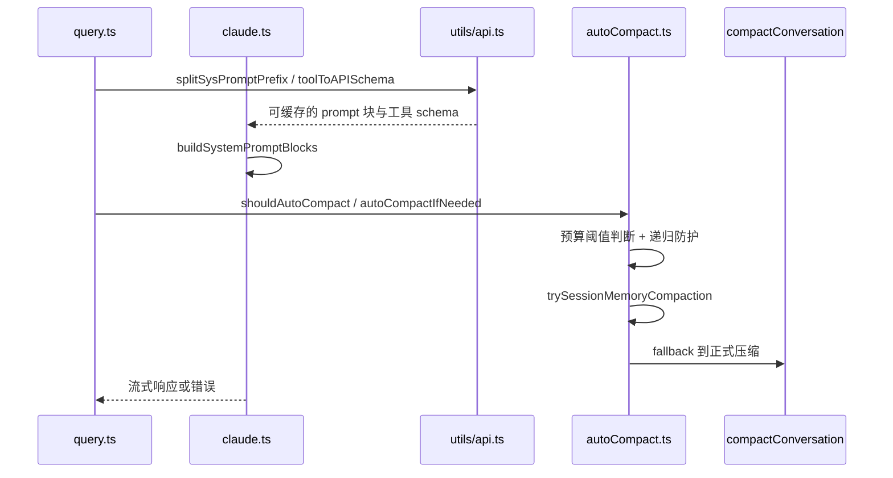

# 第 12 章 API 通信、Prompt Cache 与上下文压缩

> 对应源码主线：src/services/api/claude.ts、src/utils/api.ts、src/services/compact/autoCompact.ts、src/query.ts

## 12.1 Claude Code 的 API 层不是“把消息发出去”这么简单

在这个工程里，API 通信层要同时解决三类问题：

1. 如何把 messages 和 system prompt 变成合规请求
2. 如何尽量命中 prompt cache，降低成本
3. 如何在上下文逼近窗口极限时继续把对话跑下去

所以 services/api/claude.ts 和 compact 相关模块，本质上是“成本控制 + 上下文治理”系统的一部分。

## 12.2 buildSystemPromptBlocks()：system prompt 进入 API 之前的最后一步

在 claude.ts 里，system prompt 在真正发出去前会经过 buildSystemPromptBlocks()：

```ts
export function buildSystemPromptBlocks(
  systemPrompt: SystemPrompt,
  enablePromptCaching: boolean,
  options?: { skipGlobalCacheForSystemPrompt?: boolean; querySource?: QuerySource },
): TextBlockParam[] {
  return splitSysPromptPrefix(systemPrompt, {
    skipGlobalCacheForSystemPrompt: options?.skipGlobalCacheForSystemPrompt,
  }).map((block) => ({
    type: 'text',
    text: block.text,
    ...(enablePromptCaching &&
      block.cacheScope !== null && {
        cache_control: getCacheControl({
          scope: block.cacheScope,
          querySource: options?.querySource,
        }),
      }),
  }))
}
```

这里可以看到两件关键事实：

1. system prompt 不是一个字符串，而是会被拆成多个 block
2. 每个 block 可以拥有不同的 cache scope

这就是 Claude Code 在 prompt cache 上做精细优化的起点。

## 12.3 splitSysPromptPrefix() 的核心思想：把稳定部分和动态部分拆开

utils/api.ts 里的 splitSysPromptPrefix() 非常值得反复读。

它至少处理三种场景：

1. MCP tools 存在，跳过 global cache
2. global cache 模式且找到了动态边界 marker
3. 默认 org 级缓存模式

也就是说，系统不是笼统地“给整个 system prompt 加缓存”，而是根据 prompt 的组成和当前能力集合，动态决定哪些块能：

- 不缓存
- org 级缓存
- global 级缓存

这是一种非常工程化的缓存策略。

## 12.4 为什么 MCP tools 会影响 prompt cache 策略

splitSysPromptPrefix() 的注释已经明确指出：

- 当 MCP tools 存在时，system prompt 的稳定性会下降
- 因为工具集合可能随 server 连接状态变化

因此在这种情况下，系统会放弃更激进的 global cache，把 system prompt block 降到 org 级缓存。

这说明作者对缓存命中率的理解非常务实：

- 不是追求理论上的最大缓存范围
- 而是优先保证缓存键稳定和行为正确

## 12.5 autoCompact 的核心不是压缩，而是阈值治理

autoCompact.ts 中最关键的不是 compactConversation 本身，而是阈值判断体系。

例如：

- getEffectiveContextWindowSize(model)
- getAutoCompactThreshold(model)
- calculateTokenWarningState(tokenUsage, model)
- shouldAutoCompact(messages, model, querySource)

这里的设计很清楚：

1. 先根据模型上下文窗口和保留输出空间算出有效窗口
2. 再定义 warning、error、autocompact、blocking 等不同阈值
3. 最后根据 querySource、feature flag、context collapse 状态决定是否真的触发自动压缩

所以 autocompact 本质上是“上下文预算治理器”。

## 12.6 isAutoCompactEnabled() 为什么不只是读配置

这个函数会同时考虑：

- DISABLE_COMPACT
- DISABLE_AUTO_COMPACT
- 用户配置里的 autoCompactEnabled

也就是说，autocompact 的开关不只是 UI 设置，还受运行环境和测试/实验环境变量控制。

这说明 compact 系统本身被当成一项需要灰度、实验、强制兜底的核心能力，而不是普通偏好设置。

## 12.7 shouldAutoCompact() 为什么要看 querySource

shouldAutoCompact() 里一个很关键的点，是它会排除某些 querySource，例如：

- session_memory
- compact
- 特定 context collapse 场景

原因很直接：

- 某些 query 本身就是在做压缩或记忆整理
- 如果这些查询再触发 autocompact，就会递归或互相干扰

这说明 compact 系统并不是孤立模块，它需要理解自己所处的宿主任务语义。

## 12.8 query.ts 中的压缩链：轻处理优先，重压缩后置

前面第 6 章提到 query.ts 会串多级上下文处理。

从源码注释可以看出，其总体策略是：

- 先尝试 tool result budget、snip、microcompact、context collapse 这种更轻、更保留结构化细节的方案
- 只有确实到了阈值，才进入 autocompact 或 reactiveCompact

这个顺序的本质是：

尽量减少信息损失，同时把“上下文可持续”维持住。

## 12.9 reactiveCompact 的位置很讲究

reactiveCompact 不属于平时的预防性治理，而是：

- 已经撞上 withheld prompt-too-long / media size 等错误之后
- 尝试把这轮救回来

因此它是一种恢复机制，而不是常规主路径压缩器。

这也是为什么 query.ts 会单独跟踪：

- hasAttemptedReactiveCompact
- withheld 413 / media error

因为它必须保证：

- 只在需要时启动
- 不进入无限恢复循环

## 12.10 这一章的阅读结论

API 层、prompt cache 和压缩系统其实是一套联动设计：

1. buildSystemPromptBlocks / splitSysPromptPrefix 负责把 prompt 拆成可缓存的结构
2. autoCompact 负责在撞线前预防性治理上下文预算
3. reactiveCompact 负责在撞线后尽量挽救当前回合
4. query.ts 把这些机制统一编进 agentic loop

所以这套系统真正优化的不是“单次 API 调用”，而是“长任务、多轮工具调用场景下的持续执行能力”。

## 12.11 toolToAPISchema() 说明 API 层也在做稳定性治理

很多人看 API 层时，只会看 messages 和 system prompt。

但 utils/api.ts 里的 toolToAPISchema() 其实同样关键，因为它定义了“工具如何以稳定 schema 的形式进入 API 请求”。

源码里明确把工具 schema 分成两层：

### 会话稳定基底

- name
- description
- input_schema
- strict
- eager_input_streaming

这些会被缓存到 toolSchemaCache，避免 mid-session feature flip 或 prompt 漂移导致工具数组字节变化。

### 每次请求叠加层

- defer_loading
- cache_control

这些按请求叠加，避免污染基底缓存。

这和 system prompt 的静动态拆分，是完全一致的工程哲学。

## 12.12 splitSysPromptPrefix() 的函数级分块语义

splitSysPromptPrefix() 最重要的不是“把字符串拆开”，而是它在定义哪一段 prompt 属于哪种缓存语义。

从源码注释可以直接抽出三种模式：

1. MCP tools 存在时，system prompt 走 org 级缓存
2. 1P global cache 模式且找到了动态边界时，拆成 static/global 与 dynamic/non-cache 两段
3. 默认模式下，采用 prefix + remainder 的 org 级缓存

也就是说，这个函数本质上是在给 system prompt 打缓存边界，而不是做普通文本处理。

## 12.13 buildSystemPromptBlocks() 的真正职责：把缓存语义翻译成 API block

buildSystemPromptBlocks() 接在 splitSysPromptPrefix() 后面，负责把内部的 `SystemPromptBlock[]` 变成真正的 API `TextBlockParam[]`。

其关键转换是：

```ts
...(enablePromptCaching &&
  block.cacheScope !== null && {
    cache_control: getCacheControl(...)
  })
```

这意味着：

- splitSysPromptPrefix 负责“应该怎么缓存”
- buildSystemPromptBlocks 负责“把缓存策略编码进 API 请求”

这两个函数合起来，才是 Claude Code 的 system prompt 缓存出口。

## 12.14 API 层为什么既要关心 provider，又要关心 beta shape

toolToAPISchema() 和 claude.ts 都反复判断：

- 是否 first-party
- 是否 first-party anthropic base url
- 是否应该 include first-party only betas

原因很简单：

- 并不是所有 provider / proxy / gateway 都接受同样的 beta 字段

例如：

- defer_loading
- eager_input_streaming
- 某些 cache_control 细节

如果 API 层不做 provider-aware 降级，整个请求会直接 400。

所以这里的 API 通信不是“统一 SDK 调用”，而是“面向多后端的协议协商层”。

## 12.15 getEffectiveContextWindowSize() 才是 compact 系统的预算起点

autoCompact.ts 里真正决定预算基线的，不是 shouldAutoCompact()，而是：

```ts
export function getEffectiveContextWindowSize(model: string): number
```

它做了三步：

1. 取模型的 context window
2. 预留一部分给压缩摘要输出
3. 可选再被 `CLAUDE_CODE_AUTO_COMPACT_WINDOW` 收紧

也就是说，整个 compact 系统不是直接拿模型窗口上限来判断，而是先扣掉“为了自救必须保留的输出空间”。

这一步非常工程化。

## 12.16 calculateTokenWarningState() 定义了完整阈值语义

前面提到 warning / error / autocompact / blocking 多层阈值，这些实际上都收敛在 calculateTokenWarningState() 里。

它会同时给出：

- percentLeft
- isAboveWarningThreshold
- isAboveErrorThreshold
- isAboveAutoCompactThreshold
- isAtBlockingLimit

也就是说，这个函数不是 UI 辅助，而是整个上下文预算系统的统一判定器。

没有这一层统一判定，不同模块很容易各自用不同阈值，最后出现行为不一致。

## 12.17 shouldAutoCompact() 的真正职责：递归防护 + 预算判定

shouldAutoCompact() 不是简单比较 token 是否超阈值。

它在做预算判断前，先做了大量“不要在这里触发 autocompact”的防护，例如：

- `querySource === 'session_memory'`
- `querySource === 'compact'`
- `querySource === 'marble_origami'`
- `REACTIVE_COMPACT` 实验模式
- `CONTEXT_COLLAPSE` 已启用

这些判断说明 shouldAutoCompact() 实际承担的是：

- 防递归
- 防和其他上下文治理系统打架
- 最后才是纯 token 阈值判断

## 12.18 autoCompactIfNeeded() 的函数级执行链

把 autoCompactIfNeeded() 拉直之后，能看见它的完整自救路径：

1. 先检查 `DISABLE_COMPACT`
2. 再检查 consecutive failure circuit breaker
3. 调 `shouldAutoCompact()` 判断本轮是否需要
4. 构造 recompactionInfo
5. 优先尝试 `trySessionMemoryCompaction(...)`
6. 如果 session memory 不适用，再走 `compactConversation(...)`
7. 成功后做 `runPostCompactCleanup(...)`、`notifyCompaction(...)`、`markPostCompaction()`

这说明 autoCompactIfNeeded() 是完整的编排器，而不只是开关判断器。

## 12.19 session memory compaction 为什么优先级更高

autoCompactIfNeeded() 里有一条非常关键的分支：

- EXPERIMENT: Try session memory compaction first

这背后的逻辑很清楚：

- 如果已有 session memory 可用，就优先利用已有记忆摘要
- 这样可以少一次额外压缩调用
- 更快，也更便宜

所以 compact 系统并不是单一路径，而是在尝试把“已有的上下文资产”优先变成压缩收益。

## 12.20 API/cache/compact 这三层真正共用的设计哲学

读到这里，可以把这三层的共同点总结出来：

### API 层

把请求协议拆成 provider-aware、beta-aware、schema-stable 的形式。

### Prompt cache 层

把 system prompt 和工具 schema 拆成稳定部分与动态部分，尽量提高 cache hit。

### Compact 层

把上下文治理拆成预防性阈值管理、已有记忆复用和错误后的恢复路径。

三者共同服务的是同一个目标：

- 让长会话、长工具链、多轮执行在成本和上下文窗口内尽可能持续。

## 12.21 这一章最值得记住的治理图



这张图背后最核心的结论是：

- Claude Code 的 API 层不是请求出口，而是上下文预算、缓存稳定性和协议兼容性的总汇合点。

## 12.22 这一章和后续章节怎么衔接

第 12 章虽然讲的是 API/cache/compact，但它其实是在给前半本很多章节收束“成本与预算”这一条暗线。

1. 它承接第 4 章和第 6 章，因为上下文素材如何构造、query loop 如何恢复执行，到这里都进一步被解释成缓存边界、provider 协商和预算治理问题。
2. 它会回流到第 8 章和第 16 章，因为命令、技能、MCP tools 一旦进入正式请求，就都要服从这里定义的 schema 稳定性与 prompt cache 语义。
3. 它也会影响第 13 章，因为输出截断、prompt-too-long 和 reactive compact 的恢复逻辑，后面继续读 resume/continue 时会再次出现。

所以第 12 章不是“API 细节补充”，而是在解释统一运行时为什么能把长任务、多轮工具链和高成本上下文维持在可持续范围内。
