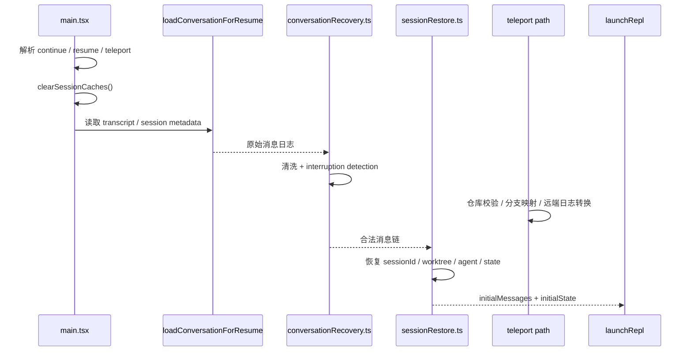

# 第 13 章 Continue、Resume 与 Teleport 恢复专题

> 对应源码主线：src/main.tsx、src/utils/conversationRecovery.ts、src/utils/sessionRestore.ts，以及 teleport 相关模块

## 13.1 这一章为什么值得单独成立

前面的第 9 章已经讲过 memory、history、transcript、resume 的基本工程分层。

但如果继续往下读，会发现 continue、resume、teleport 并不是“从磁盘读出一份会话然后继续”这么简单。

这条链路实际要同时解决：

1. 从哪里找到会话
2. 如何把历史 transcript 清洗成可再次运行的消息链
3. 如何恢复 worktree、agent、todo、file history 等运行副状态
4. Teleport 场景下如何把远端会话映射回本地仓库现场

所以它值得作为一条独立横切主线来读。

## 13.2 continue 路径是最短的恢复路径

main.tsx 里对 `--continue` 的处理非常直接：

```ts
if (options.continue) {
  clearSessionCaches()
  const result = await loadConversationForResume(undefined, undefined)
  const loaded = await processResumedConversation(result, {
    forkSession: !!options.forkSession,
    includeAttribution: true,
    transcriptPath: result.fullPath,
  }, resumeContext)
  await launchRepl(...loaded...)
}
```

这条链说明 continue 的语义是：

- 不弹选择器
- 直接取当前目录最近一次会话
- 清缓存
- 恢复会话
- 立刻重新进入 REPL

也就是说，continue 是 resume 系列里最短、最纯的一条路径。

## 13.3 resume 路径比 continue 多了一层“会话定位”

相比 `--continue`，`--resume` 的复杂度主要增加在“如何找到目标会话”。

main.tsx 里会先处理：

1. `validateUuid(options.resume)` 看它是不是 sessionId
2. 如果不是 UUID，则尝试按 custom title 精确匹配
3. 如果还不行，把它当作 searchTerm 交给交互式 picker
4. 还可能叠加 `--from-pr` 过滤

这说明 resume 不是单一入口，而是一条带多种定位策略的恢复路径。

## 13.4 loadConversationForResume() 是“读取会话”的接缝

无论 continue、resume 还是部分 teleport 恢复，最核心的会话读取接缝都是：

- `loadConversationForResume(...)`

它负责把 transcript 与元数据从 sessionStorage 层提出来，交给后面的恢复链。

这一步和 QueryEngine 没有直接关系。

也就是说，恢复系统的第一层职责仍然是：

- 找到并读出历史记录

而不是立即进入模型循环。

## 13.5 deserializeMessagesWithInterruptDetection() 为什么是恢复链的核心清洗器

conversationRecovery.ts 里最关键的函数不是普通的 deserializeMessages，而是：

- `deserializeMessagesWithInterruptDetection()`

它会按顺序做这些清洗：

1. 迁移 legacy attachment type
2. 清理非法 permissionMode
3. 过滤 unresolved tool uses
4. 过滤 orphaned thinking-only assistant message
5. 过滤纯空白 assistant 消息
6. 检测是否中断在半轮里
7. 必要时补 synthetic continuation user message
8. 必要时补 synthetic assistant sentinel

这说明恢复系统真正难的地方是：

- 历史日志并不天然等于可再次发送给模型的合法消息链

中间必须经过专门的修复与归一化。

## 13.6 interrupted turn 为什么会被统一改写

conversationRecovery.ts 对 interrupted turn 的处理非常值得学习。

它不会把“中断在半轮”这个内部状态直接向上暴露，而是把它改写成：

- 一个 interrupted_prompt 状态
- 一条新的 meta user message：`Continue from where you left off.`

这带来的好处是，上层恢复逻辑只要处理一种统一输入模型：

- “现在有一条待继续提交的用户消息”

而不用分别处理：

- 正常下一轮
- 工具执行中断
- 输出截断后的半轮残留

这是非常典型的“底层吸收复杂度，上层获得统一接口”的设计。

## 13.7 processResumedConversation() 才是恢复链真正的总装配点

sessionRestore.ts 里的 `processResumedConversation()`，可以看成恢复路径上的总装配器。

它会依次处理：

1. coordinator/normal mode 匹配
2. 是否复用原 sessionId，还是 forkSession
3. `switchSession(...)` 切换 bootstrap state
4. `resetSessionFilePointer()` 与 `adoptResumedSessionFile()`
5. `restoreSessionMetadata(...)`
6. `restoreWorktreeForResume(...)`
7. 恢复 context-collapse 状态
8. `restoreAgentFromSession(...)`
9. 计算新的 initialState

也就是说，恢复不是“把 messages 喂给 REPL”，而是把整个会话现场重新装出来。

## 13.8 forkSession 的语义：继承历史，但不接管原会话所有权

processResumedConversation() 里对 `forkSession` 的处理很有代表性。

它保留历史，但不会直接接管原会话的全部资源所有权，例如 worktree。

源码注释已经明确写出原因：

- fork 不应该把原 session 的 worktree 视为自己的退出清理对象

否则 fork 会话退出时可能误删原会话仍然依赖的工作树。

这说明 resume/fork 设计里非常注意“继承上下文”和“接管资源”是两回事。

## 13.9 continue / resume 为什么要先 clearSessionCaches()

main.tsx 在 continue 和 resume 进入恢复前，都会先：

```ts
const { clearSessionCaches } = await import('./commands/clear/caches.js')
clearSessionCaches()
```

这一步的目的不是性能，而是正确性。

因为恢复时如果沿用旧的：

- skill discovery cache
- session-related file cache
- cwd 相关缓存

就可能在新恢复的会话现场里读到陈旧状态。

因此恢复链的第一原则之一是：

- 先清旧现场缓存，再恢复新现场

## 13.10 Teleport 和普通 resume 的区别：它先解决“仓库映射”，再解决“会话恢复”

main.tsx 对 teleport 的处理和普通 resume 明显不同。

Teleport 恢复前会先做：

1. `fetchSession(teleport)`
2. `validateSessionRepository(sessionData)`
3. 必要时弹出 repo mismatch dialog
4. `checkOutTeleportedSessionBranch(...)`
5. `processMessagesForTeleportResume(...)`

这说明 teleport 的问题不是单纯恢复会话，而是：

- 如何把远端会话重新投影到本地正确的仓库和分支现场

普通 resume 假设“会话属于当前工程世界”；Teleport 则必须先重建这个工程世界。

## 13.11 Teleport interactive mode 为什么更像“远端任务选择器”

当 teleport 参数为空时，main.tsx 走的是：

- `launchTeleportResumeWrapper(root)`

也就是说，用户不是直接指定 session，而是先进入一个任务选择/恢复包装流。

这个流程得到的结果再经过：

- branch checkout
- log 转换
- messages 处理

最后才进入和普通 resume 接近的恢复链。

这说明 Teleport 模式不仅恢复会话，还在管理“远端任务到本地 TUI 恢复”的转换体验。

## 13.12 processMessagesForTeleportResume() 的作用：把远端日志翻译回本地会话消息

从 main.tsx 的调用顺序可以看出，Teleport 并不会直接把远端返回原样扔进 REPL。

中间要经过：

- `processMessagesForTeleportResume(...)`

这说明 Teleport 返回的数据模型和本地 transcript 消息模型之间，仍然需要一个专门的翻译层。

这和 remote mode / direct connect 的 adapter 思路是一致的：

- 远端协议 != 本地 REPL 内部消息协议

## 13.13 恢复链和 hook 的关系：resume 不是 startup

main.tsx 里有一段非常关键的注释：

- continue/resume/teleport paths don't fire startup hooks

以及：

- resume/continue 会走 conversationRecovery.ts 的恢复路径，不应该再重复触发 startup hooks

这说明恢复链在生命周期语义上不是一次新的普通启动。

也就是说：

- startup 是冷启动
- resume 是恢复现场

二者不能混用同一套 hook 语义，否则会产生重复副作用。

## 13.14 这一章最值得记住的恢复专题图



理解完这条链之后，应该建立一个更明确的认识：

- continue、resume、teleport 并不是三套完全不同的系统
- 它们共享同一套 transcript 清洗和状态恢复基础设施
- 差别主要在于“怎么找到会话”和“怎么把会话现场重新映射回当前运行环境”

## 13.15 这一章的阅读结论

第 13 章最重要的结论是：恢复系统真正复杂的地方，不是“把历史读出来”，而是“把历史重新变成一个当前还能继续运行的现场”。

1. continue 是最短路径，强调直接接着跑。
2. resume 增加了会话定位与筛选。
3. teleport 则把问题进一步扩展成“远端会话怎样重新投影回本地工程现场”。

所以这章真正讲透的，不是某个命令行选项，而是统一运行时如何把过去的一次会话重新装回现在。

## 13.16 这一章和后续章节怎么衔接

第 13 章是第 9 章恢复工程层的继续展开，也是后半本执行拓扑变化前的一道桥。

1. 它承接第 9 章，因为 transcript 清洗、worktree 恢复、agent 恢复这些底层能力，到了这里才真正被组织成 continue/resume/teleport 三条用户可见路径。
2. 它会直接通向第 14 章，因为 teleport 一旦涉及仓库映射、分支校验和工作树现场，就自然会把阅读继续引到 worktree 与 remote 执行拓扑。
3. 它也会回流到第 20 章，因为远端会话重新投影、本地 REPL 恢复接管和控制面切换，本质上都延续了这里“恢复现场而不是重新冷启动”的思路。

所以第 13 章可以看成恢复专题和执行拓扑专题之间的过桥章节。
