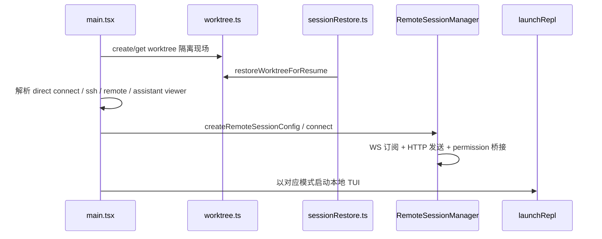

# 第 14 章 Worktree 隔离与 Remote 运行模式

> 对应源码主线：src/utils/worktree.ts、docs/agent/worktree-isolation.mdx、src/remote/RemoteSessionManager.ts，以及 main.tsx 中 direct connect / ssh / remote 分支

## 14.1 为什么这一章要把 Worktree 和 Remote 放在一起讲

表面上看，worktree 是本地文件隔离，remote 是远端会话。

但从运行模式角度看，它们解决的是同一类问题：

- 如何让 Claude Code 不再只有“当前这个本地 cwd 的单机 TUI”一种运行方式

换句话说，这一章关心的是：

- Claude Code 如何切换运行现场

为了和后文保持术语一致，这里的“运行现场”可以理解为统一运行时所在的执行拓扑：本地隔离现场、远端执行现场，或远端会话控制现场。

其中 worktree 解决本地隔离现场，remote/ssh/direct connect 解决远端执行现场。

## 14.2 Worktree 的核心语义：不是临时目录，而是会话级隔离工作区

docs/agent/worktree-isolation.mdx 已经把这个点讲得很清楚：

- worktree 在这个工程里不是普通 git 辅助功能
- 它是和 session 绑定的执行现场

`WorktreeSession` 结构里直接保存：

- originalCwd
- worktreePath
- worktreeName
- worktreeBranch
- originalHeadCommit
- sessionId
- tmuxSessionName

这说明 worktree 的抽象级别不是“目录”，而是“某次会话的隔离执行空间”。

## 14.3 validateWorktreeSlug() 体现的不是输入校验，而是边界防护

utils/worktree.ts 开头的 `validateWorktreeSlug()` 很值得看。

它防的不是普通格式错误，而是：

- 路径穿越
- 绝对路径逃逸
- worktree 目录层级污染

也就是说，worktree 名称在这个系统里本质上是一个会参与路径拼接和 git branch 命名的安全边界输入。

因此它必须先被严格约束。

## 14.4 getOrCreateWorktree() 的函数级执行链

这个函数基本定义了 worktree 的本地生命周期主路径：

1. 根据 slug 计算 `worktreePath` 和 `worktreeBranch`
2. 先读 `.git` 指针检查是否已有现成 worktree
3. 若已有，走 fast resume path，直接返回现有 HEAD
4. 若没有，则创建 `.claude/worktrees`
5. 决定 baseBranch/baseSha
6. 执行 `git worktree add`
7. 如启用 sparsePaths，再补 sparse-checkout 和 checkout

这说明 worktree 创建并不是“每次都重新 git fetch + add”，而是非常重视已存在 worktree 的快速恢复路径。

## 14.5 worktree 为什么强调 fast resume path

utils/worktree.ts 里对 existing worktree 的优化很有代表性：

- 直接读 `.git` 指针文件获取 HEAD SHA
- 避免每次 resume 都走子进程和 fetch

这背后的思路非常务实：

- 对大型仓库来说，worktree add / fetch 的开销可能是秒级
- 但“恢复一个已经存在的隔离现场”其实不该付出这笔成本

这说明 worktree 在 Claude Code 里已经被当成一种高频恢复场景，而不是一次性功能。

## 14.6 createWorktree hook 说明 Worktree 不是纯 git 绑定设计

worktree.ts 里会先判断：

- `hasWorktreeCreateHook()`

这意味着系统允许用户完全替换原生 git worktree 创建逻辑。

也就是说，Claude Code 对 worktree 的真正抽象是：

- “给我一个隔离工作现场”

git worktree 只是默认实现。

这也是为什么这个模块虽然名叫 worktree，但设计上其实更接近“workspace isolation adapter”。

## 14.7 restoreWorktreeForResume() 把恢复链和隔离现场真正接上了

sessionRestore.ts 里 `restoreWorktreeForResume()` 的存在，说明 worktree 不是仅在创建时生效。

恢复会话时，它会：

1. 检查当前是否已有 fresh worktree 优先级更高
2. 若 transcript 中记录了 worktreeSession，则尝试 `process.chdir(worktreePath)`
3. 成功后更新 cwd/originalCwd
4. 恢复 currentWorktreeSession
5. 清理 memory / system prompt / plans 相关缓存

这说明 worktree 真正影响的不是一个工具调用，而是整个后续上下文构造和提示词环境。

## 14.8 main.tsx 中 direct connect 分支的语义：本地 UI，远端执行引擎

main.tsx 对 direct connect 的处理非常典型。

这条路径会：

1. `createDirectConnectSession(...)`
2. 如果远端返回了 workDir，就把本地 bootstrap cwd 切过去
3. 构造一条 system info message
4. `launchRepl(...)`，但传入 `directConnectConfig`

这意味着 direct connect 的产品语义是：

- UI 仍在本地 TUI
- 但执行引擎已经连到远端 server

所以它不是“本地模式的一个参数”，而是另一种运行拓扑。

## 14.9 ssh 分支的语义：远端工具执行，本地终端展示

main.tsx 对 ssh 分支的注释写得很清楚：

- tools run remotely, UI renders locally

这条链路会：

1. `createSSHSession()` 或 `createLocalSSHSession()`
2. 更新 remoteCwd 到 bootstrap state
3. 生成 sshInfoMessage
4. 进入带 `sshSession` 的 REPL

因此 SSH 模式本质上是在本地 UI 外面套了一层远端执行壳。

它和 direct connect 的共同点是：

- 控制台在本地
- 能力执行在远端

## 14.10 remote 模式的关键：本地 TUI 不再自己跑 agent loop

main.tsx 对 `--remote` 的处理最值得抓住的一点是：

- 本地 CLI 创建或恢复远端 CCR session
- 然后把 REPL 变成这个远端 session 的 viewer/controller

这条路径里很关键的接缝是：

- `createRemoteSessionConfig(...)`
- `filterCommandsForRemoteMode(commands)`
- `launchRepl(... remoteSessionConfig ... )`

也就是说，进入 remote mode 之后，本地 REPL 已经不是完整的本地 agent 宿主，而是一个远端会话的本地界面。

## 14.11 RemoteSessionManager 的真正职责：把 CCR 会话翻译成 REPL 可消费的会话流

RemoteSessionManager 不是普通的 WebSocket 封装器。

它同时协调：

1. WebSocket 订阅远端消息
2. HTTP POST 发送用户消息
3. 远端 permission request / response 流
4. reconnect / disconnect / interrupt

这说明 remote 模式不是“把消息拉回来显示”，而是本地 REPL 和远端会话之间的完整控制桥。

## 14.12 RemoteSessionManager 的函数级消息流

如果按函数链看，它的职责很清晰：

1. `connect()` 建立 SessionsWebSocket
2. `handleMessage(...)` 区分 SDKMessage 与 control 消息
3. `handleControlRequest(...)` 处理远端发来的权限请求
4. `sendMessage(...)` 通过 HTTP 把用户内容发到远端 session
5. `respondToPermissionRequest(...)` 把本地审批结果回送 CCR
6. `cancelSession()` 发送 interrupt

这基本就是一套“远端 agent 会话适配器”。

## 14.13 为什么 remote mode 要预过滤命令

main.tsx 在 remote 模式进入 REPL 前，会先：

- `filterCommandsForRemoteMode(commands)`

原因很直接：

- 远端会话下，并不是所有本地 slash command 都仍然安全或有意义

例如依赖：

- 本地文件系统
- 本地 Ink 交互
- 本地 IDE 集成

的命令，就不能在 remote mode 下原样开放。

这和前面 tools.ts 对模式裁剪的思路完全一致。

## 14.14 assistant viewer mode 说明 remote 不止一种

main.tsx 里还有一条很特别的远端分支：

- `claude assistant [sessionId]`

这条路径会：

- 发现或选择 assistant session
- 生成 `remoteSessionConfig(... viewerOnly=true)`
- 把 REPL 变成一个只读或弱控制的 viewer 客户端

也就是说，remote 模式并不是只有一种“交互远端会话”。

它至少还细分出：

- 全功能 remote session client
- viewerOnly assistant session client

## 14.15 这一章最值得记住的模式装配图

这一章读完之后，应该把 Claude Code 的运行模式理解成一组“现场切换能力”：

- worktree 负责切换本地隔离现场
- direct connect / ssh 负责切换远端执行现场
- remote / assistant viewer 负责切换远端会话控制现场

而 REPL 只是这些现场在终端里的统一表现层。

## 14.16 这一章和后续章节怎么衔接

第 14 章是前半本走向后半本的真正入口：

1. 它承接第 1 章的全局架构，把“统一运行时”从单一本地 TUI 扩展到多种执行拓扑。
2. 它会直接通向第 20 章，因为那一章要回答的正是这些不同 remote/bridge/ssh/direct connect 现场为什么还能被收敛成同一种统一控制面。
3. 它也会回流到第 10 章，因为无论执行现场怎样变化，REPL 最终仍然是这些模式在本地终端里的统一交互壳。

所以第 14 章的重点不只是模式枚举，而是告诉你：Claude Code 的统一运行时本来就不是绑死在“当前这个 cwd 的本地单机会话”上的。

## 14.17 这一章的阅读结论

第 14 章真正讲清楚的，不是几种 remote/worktree 模式的功能差异，而是统一运行时如何在不同执行拓扑之间迁移。

1. worktree 说明会话可以绑定到隔离工作现场，而不是只绑定当前目录。
2. direct connect、ssh、remote、assistant viewer 说明执行现场、控制现场和展示现场可以被拆开。
3. REPL 之所以仍然能维持统一体验，是因为这些模式最终都被压回了同一套交互壳和会话控制接口。

所以第 14 章最好被理解成“执行拓扑章节”：它在告诉你 Claude Code 的统一运行时从来不是单机单现场的固定结构，而是一套可以跨现场投影和切换的运行模型。
