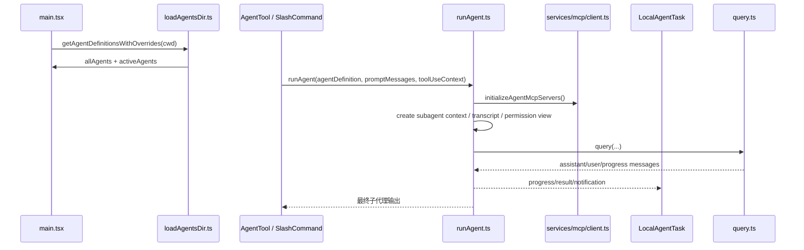

# 第 15 章 AgentTool 与子代理执行体系

> 对应源码主线：src/tools/AgentTool/loadAgentsDir.ts、src/tools/AgentTool/runAgent.ts、src/tasks/LocalAgentTask/LocalAgentTask.tsx、src/Tool.ts，以及 main.tsx 中 agentDefinitions 装配逻辑

## 15.1 为什么要单独讲 AgentTool

前面几章已经把主线程 agent loop 讲清楚了，但 Claude Code 里并不只有一个 agent。

这个工程里还有一整套“子代理体系”：

- 主线程可以把工作 fork 给其他 agent
- 子代理可以拥有自己的 prompt、权限模式、工具范围、MCP servers
- 子代理可以前台串行执行，也可以后台 task 化执行
- 子代理还能被 teammate、workflow、scheduled task 等不同入口复用

所以 AgentTool 真正解决的问题不是“再起一个模型调用”，而是：

- 如何把一个新 agent 作为受控运行时单元嵌进现有会话系统

为了和后文术语保持一致，这一章里的“二级运行时”可以直接理解为“子代理运行时”。

## 15.2 agent 定义层：loadAgentsDir.ts 负责的不是读取 Markdown，而是能力声明装配

loadAgentsDir.ts 最容易被误解成“把 agents 目录扫一遍”。

实际上它做的是 agent definition assembly。

这里的 agent 来源至少有五层：

- built-in agents
- plugin agents
- user settings agents
- project settings agents
- flagSettings，也就是 CLI 通过 agents JSON 注入的 agent

这就是为什么它最后输出的不是一个文件列表，而是：

- allAgents
- activeAgents
- allowedAgentTypes
- failedFiles

也就是说，agent 在这里已经被提升成运行时能力目录，而不是配置文件对象。

## 15.3 AgentJsonSchema 透露了子代理运行时的真正配置面

这一段 schema 很关键，因为它告诉你 agent 能改写哪些运行时边界。

它不只是 description、prompt、model 这种基础字段，还包括：

- tools
- disallowedTools
- skills
- permissionMode
- mcpServers
- hooks
- maxTurns
- initialPrompt
- memory
- background
- isolation

这说明一个 agent definition 实际上是在声明：

- 它能看到什么能力
- 它用什么权限模式执行
- 它是否附加自己的 MCP 连接
- 它是否作为后台 agent 运行
- 它是否要求 worktree 或 remote 隔离

所以 agent frontmatter 本质上不是“提示词元数据”，而是一个轻量 runtime spec。

## 15.4 getActiveAgentsFromList() 体现的是覆盖优先级，而不是简单去重

这个函数把 agent 按来源拆成：

- built-in
- plugin
- user
- project
- flag
- managed

然后依次写入同一个 Map，用 agentType 作为 key。

这背后的语义非常明确：

- Claude Code 允许多层来源声明同名 agent
- 但最终只有一个 active agent 会进入运行时
- 后写入的来源覆盖前面的来源

因此 activeAgents 不是“所有 agent 的合集”，而是“经过治理后的生效 agent 视图”。

## 15.5 getAgentDefinitionsWithOverrides() 是启动期 agent 能力总线

main.tsx 在 setup 前后会尽量并行预热 commands 和 agents，这一点前面已经见过。

在 agent 这条链路里，真正的入口就是：

- getAgentDefinitionsWithOverrides(currentCwd)

它做了几件决定性的事：

1. simple mode 下只保留 built-in agents
2. 从 agents 目录加载 markdown agent
3. 解析失败文件并保留 failedFiles 供诊断
4. 并发加载 plugin agents
5. 在特性开启时初始化 agent memory snapshot
6. 合并 built-in、plugin、自定义 agent，得到 allAgents
7. 再通过 getActiveAgentsFromList 得到 activeAgents

所以它不是一个“读配置”的 util，而是启动阶段的 agent registry builder。

## 15.6 main.tsx 里 agentDefinitions 的装配位置很有意思

main.tsx 里有一段很值得精读：

1. 先并发拿到 commands 和 agentDefinitionsResult
2. 再解析 CLI 传入的 agentsJson
3. 把 CLI agents 拼进 allAgents
4. 再次调用 getActiveAgentsFromList 生成最终 activeAgents
5. 根据 agent flag 或 settings 决定 mainThreadAgentDefinition

这里最关键的认识是：

- CLI 注入 agent 不是一个旁路逻辑
- 它直接进入同一套 registry 覆盖链

因此主线程 agent 和子代理 agent 用的是一套统一定义系统，而不是两套不同模型。

## 15.7 AgentTool 真正的核心不在 UI，而在 runAgent()

很多人看到 AgentTool 会先去找某个具体工具组件，但真正的执行内核在：

- runAgent.ts 的 runAgent(...)

这个函数不是“帮你再调一次 query()”。

它做的是把父会话 fork 成一个新的 agent execution context。

它的输入非常能说明问题：

- agentDefinition
- promptMessages
- toolUseContext
- canUseTool
- isAsync
- forkContextMessages
- availableTools
- allowedTools
- contentReplacementState
- useExactTools
- worktreePath
- transcriptSubdir
- onQueryProgress

这已经不是一个普通 helper，而是完整的子代理执行合同。

## 15.8 runAgent() 的第一层职责：建立独立 agent 身份与 sidechain transcript

runAgent 一进来先做几件基础设施级动作：

- 解析 agent model
- 生成或接收 agentId
- 需要时设置 transcriptSubdir
- 注册 perfetto tracing agent 层级
- 构造 initialMessages

这里最重要的是 agentId 和 sidechain transcript。

这意味着子代理不是把消息混进主 transcript，而是拥有自己的侧链记录。

后面像：

- clearAgentTranscriptSubdir
- recordSidechainTranscript
- writeAgentMetadata

这些调用都说明 Claude Code 是把子代理当成可恢复、可观察、可追踪的独立会话单元。

## 15.9 forkContextMessages 的语义：继承父上下文，但不是原样复制父轨迹

runAgent 对 forkContextMessages 做的第一件事是：

- filterIncompleteToolCalls(forkContextMessages)

这个动作很关键。

它说明子代理虽然需要继承父上下文，但不能直接照搬父消息流。

原因是：

- 父会话里可能存在尚未闭合的 tool_use / tool_result 对
- 直接把不完整轨迹喂给子代理会破坏 API 协议合法性

所以 fork 在这里不是 transcript clone，而是 protocol-safe replay。

## 15.10 子代理不是完全从零开始，它会继承父工具上下文中的关键状态

runAgent 会把父上下文中的这些状态带过去：

- readFileState
- contentReplacementState
- mainLoopModel
- tool permission context
- root AppState store 写口

而 Tool.ts 里 ToolUseContext 又明确暴露了这些 agent 相关字段：

- agentDefinitions
- agentId
- agentType
- renderedSystemPrompt
- contentReplacementState
- refreshTools
- mcpClients
- mcpResources
- setAppStateForTasks

这说明子代理执行并不是脱离主系统单独跑，而是通过 ToolUseContext 共享一部分“会话基底能力”。

## 15.11 initializeAgentMcpServers() 揭示了 agent 可以附加自己的 MCP 能力面

这一段非常关键。

agent frontmatter 里的 mcpServers 支持两种形式：

- 直接引用已有 server 名字
- 直接内联一个新的 server 配置

initializeAgentMcpServers() 的处理逻辑是：

1. 没有 mcpServers，就直接复用父 clients
2. 若是字符串引用，就从全局配置里查已有 server
3. 若是内联定义，就构造 dynamic ScopedMcpServerConfig
4. connectToServer(name, config)
5. 对 connected client 调 fetchToolsForClient(client)
6. 把 agent-specific clients 和 tools 叠加回去
7. 结束时只清理 inline 创建出来的新 client

这个设计非常精细，因为它区分了：

- 共享连接
- agent 私有连接

也就是说，子代理不仅能借父会话的 MCP，还能带着自己的增量 MCP surface 启动。

## 15.12 agent 的权限模式不是 UI 配置，而是 runAgent 内部重新包了一层 getAppState

runAgent 内部会构造 agentGetAppState()。

它不是简单读父 AppState，而是会在读取时覆盖：

- toolPermissionContext.mode

前提是 agentDefinition 指定了 permissionMode，且父模式不是更高优先级的 bypass/acceptEdits/auto。

这说明 agent 权限模式并不是“启动前选一次”，而是在子代理自己的上下文读取层里重新生效。

换句话说：

- 父线程和子代理可以共享同一个大 AppState
- 但子代理看到的是一个重写过权限视图的 AppState

## 15.13 availableTools 与 allowedTools 的双层设计很重要

runAgent 接口里既有：

- availableTools
- allowedTools

这两个字段不是重复的。

它们分别表示：

- availableTools：候选工具全集
- allowedTools：在 agent session allow rules 上再收窄一层

源码注释已经说得很清楚：

- 当 provided allowedTools 存在时，要替换全部 allow rules，避免父审批泄漏进子代理

这说明 Claude Code 在子代理这里非常重视权限闭包。

父线程批准过某类工具，不代表 fork 出来的 agent 自动继承同样批准面。

## 15.14 useExactTools 的存在，说明有一类子代理是为 prompt cache 稳定性服务的

runAgent 的注释里专门写了：

- useExactTools 为 fork subagent 路径服务
- 目标是产出 byte-identical API request prefixes 以命中 prompt cache

这说明子代理体系不只是一个行为复用系统，它还承担了协议稳定性优化。

也就是说，子代理在某些路径下必须做到：

- 工具顺序一致
- thinkingConfig 一致
- 非交互配置一致

这本质上是在服务 API cache hit，而不是服务功能正确性本身。

## 15.15 sidechain transcript 为什么必须保留 contentReplacementState

runAgent 支持传入 contentReplacementState，并在注释中说明：

- resumed sidechain transcript 需要复用相同 replacement 结果
- 否则 prompt cache 稳定性会被破坏

这个点很容易忽略。

Claude Code 里很多工具结果不会直接原样进上下文，而是会走 replace/persist 机制。

如果子代理恢复后 replacement key 变了，那么：

- transcript 逻辑上相同
- 但 API 输入字节级不同

于是缓存命中就丢了。

所以这里保留的不是一个小状态，而是 prompt determinism 的前提条件。

## 15.16 LocalAgentTask 让“后台 agent”变成统一任务系统的一等公民

如果说 runAgent 解决的是执行问题，那么 LocalAgentTask 解决的是生命周期问题。

LocalAgentTaskState 里能看到子代理真正被工程化后的状态面：

- agentId
- prompt
- selectedAgent
- agentType
- abortController
- progress
- result
- pendingMessages
- retain
- diskLoaded
- evictAfter

这意味着后台 agent 并不是一个悬空 Promise，而是进入了统一 task framework。

## 15.17 LocalAgentTask 的重点不是 kill，而是“可后台、可恢复、可观察”

这一组函数连起来看就很清楚：

- queuePendingMessage
- appendMessageToLocalAgent
- drainPendingMessages
- enqueueAgentNotification
- killAsyncAgent
- killAllRunningAgentTasks

它们解决的是三件事：

1. 子代理中途还能继续接收消息
2. 子代理完成后可以向主线程回送通知
3. 子代理可以从前台切后台，再从后台切回面板视图

所以 LocalAgentTask 不是一个“后台执行补丁”，而是子代理在 UI 与会话框架中的正式宿主。

## 15.18 为什么 LocalMainSessionTask 和 InProcessTeammateTask 也会复用这套结构

grep 结果能看到：

- LocalMainSessionTask 复用 LocalAgentTaskState
- inProcessRunner 里也直接复用 runAgent()

这说明 Claude Code 对 agent 的抽象已经统一成：

- 只要是一个可独立推理、可执行工具、可汇报进度的智能单元
- 就尽量复用同一套 runAgent + task state 模型

因此 AgentTool 并不是一个孤立工具，而是更大范围 agent runtime 的公共内核。

## 15.19 processSlashCommand.tsx 进一步证明子代理是“命令执行后端”而不是“特殊模式”

在 slash command 的处理链里，遇到某些 prompt skill / scheduled task / forked command 时，也会直接：

- for await (const message of runAgent(...))

这意味着 runAgent 已经不再局限于“AgentTool 点击后触发”。

它是 command system、skill system、scheduled task system 共用的一条 agent execution backend。

## 15.20 这一章最值得记住的执行链

## 15.21 这一章的阅读结论

读完 AgentTool 这一章，应该建立起下面这个判断：

- Claude Code 的子代理不是“再发一个请求”
- 它是一套完整的子代理运行时

这套运行时具备：

- 自己的 agent registry
- 自己的 prompt 与上下文装配
- 自己的权限视图
- 自己的 sidechain transcript
- 自己的 MCP 增量能力
- 自己的 task 生命周期与通知系统

所以真正应该记住的不是 AgentTool 这个名字，而是：

- runAgent + LocalAgentTask 才是 Claude Code 子代理体系的核心组合

## 15.22 这一章和后续章节怎么衔接

把第 15 章放回后面的主线里，可以更清楚地看出它的枢纽作用：

1. 第 16 章会继续展开这里提到的 `initializeAgentMcpServers()`，解释子代理为什么不仅能复用父 MCP，还能叠加自己的 MCP surface。
2. 第 17 章会把这里的 `LocalAgentTask` 从“子代理宿主”进一步展开成统一任务框架，说明后台 agent 为什么能进入 Coordinator 面板和前后台视图切换。
3. 第 18 章会沿着这里的 agent hooks、permissionMode 和独立上下文继续下钻，解释子代理为什么能拥有自己的 hook 生命周期和权限仲裁链。
4. 第 19 章会把这里的 `runAgent` 复用再往前推一步，说明 in-process teammate 为什么本质上也是同一套 agent runtime 的协作化变体。

所以第 15 章最好的阅读姿势不是把它当成一个孤立专题，而是把它看成后面第 16 到第 19 章的共同起点。
