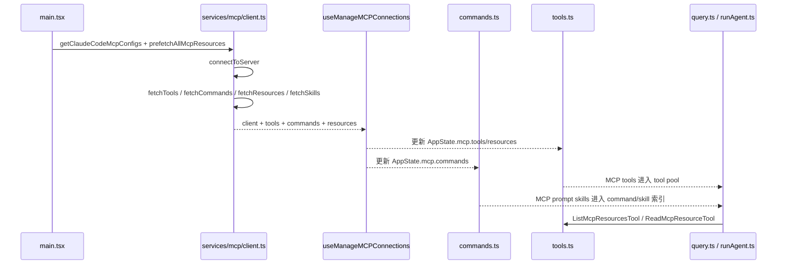

# 第 16 章 MCP 连接、资源与技能工具接入专题

> 对应源码主线：src/services/mcp/client.ts、src/services/mcp/MCPConnectionManager.tsx、src/services/mcp/useManageMCPConnections.ts、src/tools/ListMcpResourcesTool/ListMcpResourcesTool.ts、src/tools/ReadMcpResourceTool/ReadMcpResourceTool.ts、src/commands.ts，以及 main.tsx 中 MCP 预热逻辑

## 16.1 这一章为什么重要

前面第 8 章已经讲过命令系统和 MCP 扩展，但那一章更偏能力索引。

这一章要回答的是更底层的问题：

- 一个 MCP server 是如何从配置项，变成主 Agent 循环里真实可调用的 tools、commands、skills 和 resources 的

也就是说，这一章讨论的不是“有没有 MCP”，而是：

- MCP 能力是怎样被接线进 Claude Code 主运行时的

## 16.2 不要先看 MCPConnectionManager，要先看 services/mcp/client.ts

MCP 最容易读偏的地方在这里。

看到 `MCPConnectionManager.tsx` 很容易以为它是连接总管，但真正的能力总线其实是：

- services/mcp/client.ts

原因很简单：

- connectToServer 在这里
- fetchToolsForClient 在这里
- fetchCommandsForClient 在这里
- fetchResourcesForClient 在这里
- prefetchAllMcpResources 在这里
- MCP prompt/tool/result 的协议转换也在这里

而 MCPConnectionManager 与 useManageMCPConnections 更多解决的是：

- React 生命周期
- AppState 同步
- 重连、启停和通知

所以这两层必须分开理解。

## 16.3 main.tsx 中 MCP 启动策略：先并行读取配置，后延迟连接资源

main.tsx 对 MCP 的处理非常克制。

它会先做：

- getClaudeCodeMcpConfigs(dynamicMcpConfig)

而源码注释明确写了：

- 这里只提前读取配置，不提前执行连接
- prefetchAllMcpResources 延迟到 trust dialog 之后再做

这说明启动阶段把 MCP 拆成了两步：

1. 配置发现
2. 能力预热

背后的设计动机很清楚：

- 配置读取安全且便宜
- 真正连接 server 可能涉及本地进程、网络 IO、OAuth、权限边界

因此 MCP 不会粗暴地在启动最前面全部拉起。

## 16.4 connectToServer 之前，client.ts 先定义了大量传输与协议兼容层

只要看一眼 client.ts 头部 import 就知道，这个文件不是普通 util：

- StdioClientTransport
- SSEClientTransport
- StreamableHTTPClientTransport
- WebSocketTransport
- SdkControlClientTransport
- OAuth / auth cache / keychain / proxy / mTLS / session ingress auth

这说明 Claude Code 对 MCP 的抽象不是“调一下 SDK client”。

它真正做的是：

- 把多种 transport、认证模式、运行环境差异收敛到一条统一 MCP client 轨道上

## 16.5 fetchToolsForClient() 是 MCP tool 进入 Claude Code Tool 抽象的核心桥

这一段非常关键。

它先发：

- tools/list

然后把 MCP tool 转成 Claude Code 内部 Tool：

- buildMcpToolName(client.name, tool.name)
- 注入 mcpInfo.serverName / toolName
- 标记 isMcp = true
- 处理 anthropic/searchHint、alwaysLoad 等 meta

也就是说，MCP tool 并不会以原生 MCP 结构直接流入 query.ts。

它一定先被转译成 Claude Code 统一 Tool 形态。

这一步非常重要，因为后续工具池、权限判定、tool schema 输出、streaming executor 都只认内部 Tool 抽象。

## 16.6 mcp tool name 为什么要带 server 前缀

`buildMcpToolName(client.name, tool.name)` 暗示了一个关键设计：

- 不同 server 里的同名工具必须被命名空间隔离

否则会出现：

- 工具名冲突
- 权限规则无法精确匹配
- tool_use 结果无法唯一映射回具体 server

只有在某些 SDK MCP 特殊模式下，才允许跳过这个前缀，让 MCP 工具与 builtin 同名覆盖。

因此默认前缀模式其实是 Claude Code 把外部能力安全接进内部工具总线的基础条件。

## 16.7 getMcpToolsCommandsAndResources() 才是“单个 server 接入结果”的聚合点

client.ts 里有一条特别重要的聚合链：

1. connectToServer(name, config)
2. 看 server 是否支持 resources
3. Promise.all 拉：
   - fetchToolsForClient(client)
   - fetchCommandsForClient(client)
   - fetchMcpSkillsForClient(client)
   - fetchResourcesForClient(client)
4. 把返回结果组合成：
   - client
   - tools
   - commands
   - resources

这说明一个 MCP server 接入后，不只可能暴露 tools。

它还能同时暴露：

- prompt commands
- skill resources
- 普通 resources

所以 MCP 在 Claude Code 里是一整套 capability provider，而不是单一工具源。

## 16.8 ListMcpResourcesTool 和 ReadMcpResourceTool 为什么必须存在

很多人第一反应会觉得这两个工具只是“补充功能”，其实不是。

这两个工具是 MCP resource model 进入主 agent loop 的关键桥梁。

原因是：

- resources 本身不会自动变成模型可读上下文
- 它们需要通过内部 Tool 抽象，才能进入现有 tool_use / tool_result 协议链

所以 client.ts 在发现 server 支持 resources 后，会把：

- ListMcpResourcesTool
- ReadMcpResourceTool

作为 helper tools 加进来。

这意味着 Claude Code 对资源的处理策略不是“偷偷塞进 prompt”，而是：

- 把资源读取能力显式建模成工具调用

## 16.9 ListMcpResourcesTool：资源发现层，不是资源读取层

ListMcpResourcesTool 的 call 逻辑很清晰：

1. 根据 input.server 可选过滤目标 server
2. 对每个 client 先 ensureConnectedClient(client)
3. 再 fetchResourcesForClient(fresh)
4. 单个 server 失败时仅记日志，不让整体失败
5. 最后把所有资源扁平化返回

这里最值得注意的是两个设计点：

- fetchResourcesForClient 有 LRU 缓存
- ensureConnectedClient 在健康时 no-op，在断连后会取 fresh 连接

这说明资源列表是一个“缓存优先但允许重连修复”的读路径。

## 16.10 ReadMcpResourceTool：把资源读取纳入 Claude Code 统一结果治理

ReadMcpResourceTool 的 call 逻辑进一步体现了工程化处理：

1. 校验目标 server 存在且已连接
2. 校验 server 支持 resources
3. 直接发 `resources/read`
4. 若返回 text，直接保留
5. 若返回 blob，则先 base64 解码，再 persistBinaryContent 落盘
6. 返回 blobSavedTo 和说明文本，而不是把大段 base64 直接塞回上下文

这一点很关键。

Claude Code 没有把 MCP 资源当成“SDK 返回什么我就原样喂模型”。

它会主动做：

- 二进制持久化
- 结果体积治理
- 用户可理解的落盘提示

这和前面普通工具输出的替换/持久化思路完全一致。

## 16.11 prefetchAllMcpResources() 的职责不是只预取 resources

名字看起来像“预取所有 MCP 资源”，但源码里它实际汇总的是：

- clients
- tools
- commands

它的内部实现是通过 `getMcpToolsCommandsAndResources(...)` 逐个 server 回调聚合，等全部完成后再一次 resolve。

这说明 prefetchAllMcpResources 实际上是：

- MCP 启动预热总线

它做的不止是资源预取，而是把 MCP server 暴露出的多种能力一并拉平带回启动层。

## 16.12 为什么 useManageMCPConnections() 要和 client.ts 分层

如果 client.ts 是能力总线，那么 `useManageMCPConnections()` 解决的就是“这些能力如何在交互期保持新鲜”。

这个 hook 主要负责：

- 初始化 MCP clients
- 监听连接生命周期
- 在 AppState.mcp 下同步 clients/tools/commands/resources
- 做 batched state update
- 监听 list_changed 通知后失效缓存并刷新
- 做 reconnect 和 toggle enabled

这就解释了为什么它的内部会同时操作：

- clearServerCache
- fetchToolsForClient.cache
- fetchCommandsForClient
- fetchResourcesForClient

因为 UI 层关心的不是“怎么连”，而是“连接变了以后 AppState 怎样保持一致”。

## 16.13 updateServer() 和批量 flush 说明 MCP 更新是持续流，而不是一次性初始化

useManageMCPConnections 里很重要的一点是：

- pendingUpdatesRef + flushPendingUpdates + setTimeout batching

这意味着 MCP 状态更新在这里被当成持续到来的事件流，而不是启动阶段一次性写死的数据。

它要处理的现实问题包括：

- 不同 server 连接速度不同
- 某些 server 后续才上报 tool/resource list_changed
- reconnect 后 client 已换新，但 UI 不能抖动式多次重排

所以这里做的是一个小型增量同步器。

## 16.14 MCPConnectionManager.tsx 的角色：把 reconnect / toggle 能力暴露给 React 树

这个文件本身很薄，但它的重要性在于分层清晰。

它做的事只有：

- 调 useManageMCPConnections
- 取出 reconnectMcpServer、toggleMcpServer
- 通过 React Context 下发

所以 MCPConnectionManager 不是业务总线，它是一个 UI integration adapter。

读到这里应该建立一个判断：

- 真正复杂的是 client.ts 和 useManageMCPConnections
- MCPConnectionManager 只是把这套能力安全挂到组件树上

## 16.15 MCP skills 为什么在 commands.ts 里还要再筛一层

前面第 8 章已经讲过 `getMcpSkillCommands(mcpCommands)`，这里再从接线角度看一次会更清楚。

commands.ts 明确要求 MCP skills 满足：

- cmd.type === 'prompt'
- cmd.loadedFrom === 'mcp'
- !cmd.disableModelInvocation

也就是说，并不是所有 MCP commands 都会进入模型 skill 索引。

这里只有“模型可调用的 prompt 型 MCP command”才算 MCP skill。

这和 MCP tool 的处理路径是不同的：

- MCP tool 进入 Tool pool
- MCP skill 进入 command/skill 索引

两者虽然都来自 MCP server，但在运行时是两条不同通道。

## 16.16 为什么 processSlashCommand / runAgent 都要关心 MCP 连接是否稳定

在 `processSlashCommand.tsx` 里，有一段专门等待 MCP pending clients 结束再 refresh tools。

这背后的问题非常真实：

- 如果 scheduled task 或 forked command 太早抓取 context.options.tools
- 它拿到的可能是 MCP 尚未连接完成前的旧工具集

因此这里会：

1. 轮询 AppState.mcp.clients 是否还有 pending
2. 等稳定后走 `refreshTools?.()`
3. 再把 freshTools 传给 runAgent

这说明 MCP 接入不是静态初始化细节，而会直接影响子代理的工具可见性正确性。

## 16.17 agent-specific MCP servers 说明 MCP 不只属于主线程

第 15 章里已经看到 runAgent 的 `initializeAgentMcpServers()`。

把这一点和本章合起来看，就能得到一个更完整的认识：

- MCP 不只是 main.tsx 启动时接一遍
- 子代理运行时也能增量挂载自己的 MCP servers

这意味着 Claude Code 的 MCP 体系实际上支持两级装配：

- 会话级 MCP
- agent 级 MCP

因此 client.ts 被设计得足够通用，既能服务主线程启动，也能服务子代理临时接线。

## 16.18 资源工具为什么要放进全局工具清单和权限系统里

`tools.ts` 里可以看到：

- ListMcpResourcesTool
- ReadMcpResourceTool

都被纳入工具总表和命名清单。

这意味着它们和普通工具一样会经过：

- tool visibility
- deny rules
- auto classifier
- tool schema 输出

这很重要，因为只有进入统一工具总线，MCP 资源访问才具备：

- 一致的审批与安全模型
- 一致的 transcript 记录
- 一致的 tool_result 闭环

## 16.19 这一章最值得记住的接线图

## 16.20 这一章的阅读结论

Claude Code 的 MCP 设计，核心不是“支持 MCP 协议”，而是把 MCP server 稳定地接进现有 Agent 操作系统。

它通过分层实现了这件事：

- client.ts 负责协议接入与能力转译
- useManageMCPConnections 负责交互期状态同步与重连
- MCPConnectionManager 负责把控制能力挂到组件树
- commands.ts 把 MCP prompt command 再筛成 skills
- tools.ts 把 MCP resource helper tools 纳入统一工具总线
- runAgent 允许子代理继续叠加自己的 MCP servers

所以真正应该记住的结论是：

- MCP 在 Claude Code 里不是外挂插件，而是被翻译进主运行时内部抽象的一等能力源

## 16.21 这一章和后续章节怎么衔接

这一章往后至少会接到三条很关键的支线：

1. 第 15 章提到子代理可以增量挂 MCP server，而这一章给出的 `client.ts + useManageMCPConnections` 分层，就是那条子代理 MCP 接线复用的基础。
2. 第 18 章里的 MCP elicitation、channel permission relay 和连接期回调注册，都建立在这里的 MCP connection lifecycle 之上；如果不先理解这一章，就很难看懂为什么权限与交互链会直接挂在连接层。
3. 第 20 章讲 remote control 与统一控制面时，远端权限请求、结构化回调和状态同步之所以能成立，也复用了这里这种“协议接入层”和“UI 状态层”分开的思路。

换句话说，第 16 章虽然主题是 MCP，但它其实提前铺好了后面 hook、权限仲裁和远程控制里那套“协议层与交互层分离”的设计语言。
