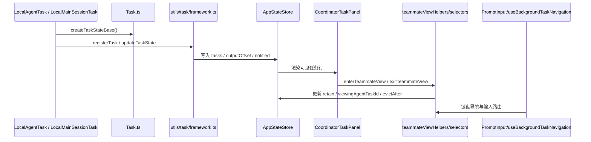

# 第 17 章 Task 框架、Coordinator 与后台任务体系

> 对应源码主线：src/Task.ts、src/utils/task/framework.ts、src/tasks/LocalAgentTask/LocalAgentTask.tsx、src/tasks/LocalMainSessionTask.ts、src/components/CoordinatorAgentStatus.tsx、src/state/teammateViewHelpers.ts、src/state/selectors.ts、src/hooks/useBackgroundTaskNavigation.ts

## 17.1 为什么这一章值得单独成立

前面讲 AgentTool 和子代理时，已经看到 Claude Code 能把一些工作放到后台执行。

但继续往下读会发现，这里的“后台”不是一个随手开的 Promise，也不是单纯的 shell job。

Claude Code 实际上做了一整套统一任务运行时：

- agent 可以后台化
- 主会话本身也可以后台化
- shell、workflow、remote agent 也都挂在同一张任务表上
- REPL 还能在主线程和后台任务之间来回切视图

所以这一章真正关心的问题是：

- Claude Code 如何把异步工作变成可观察、可切换、可回收的任务系统

后文如果出现“任务体系”或“任务状态机”，默认都和本章的“统一任务框架”是同一件事，只是观察角度不同。

## 17.2 Task.ts：任务系统的最小公共协议

Task.ts 很短，但它定义了整个任务体系的骨架。

最关键的几个类型是：

- TaskType
- TaskStatus
- TaskStateBase
- Task
- TaskContext

其中 `TaskStateBase` 统一要求所有任务都带这些字段：

- id
- type
- status
- description
- toolUseId
- startTime / endTime
- outputFile / outputOffset
- notified

这说明在 Claude Code 里，“任务”的最低抽象不是业务类型，而是：

- 能被跟踪状态
- 能产出输出文件
- 能被通知系统消费

## 17.3 createTaskStateBase() 体现的是统一可观测性，不只是偷懒复用

`createTaskStateBase()` 看上去只是帮忙填默认值，但它暴露出几个很重要的设计点：

- 所有任务默认从 pending 开始
- 所有任务都要映射到 `getTaskOutputPath(id)`
- 所有任务都有 outputOffset 和 notified 这两个“增量通知”字段

也就是说，任务体系从一开始就假设：

- 任务输出不是一次性结果，而是一个可持续读取的输出流

这也是为什么后面 framework.ts 会围绕 output delta 和终态通知来组织。

## 17.4 framework.ts 的职责：不是执行任务，而是管理任务状态演化

utils/task/framework.ts 的分层非常明确。

它不关心某个任务具体怎么跑，而是只做这些通用治理：

- `updateTaskState()`
- `registerTask()`
- `evictTerminalTask()`
- `generateTaskAttachments()`
- `applyTaskOffsetsAndEvictions()`
- `pollTasks()`

这说明 framework.ts 更像任务状态总线，而不是任务执行器。

## 17.5 updateTaskState() 的重点是“增量更新且避免无效重渲染”

`updateTaskState()` 里有一个很容易忽略的细节：

- 如果 updater 返回的是同一个引用，就直接返回 prev，不做 spread

这意味着任务系统明确考虑了高频状态更新的渲染成本。

尤其像：

- tool progress
- token count
- 队列消息
- reconnect / shell output

这些都可能频繁触发更新。

所以它不仅要“能改状态”，还要“避免没必要的状态风暴”。

## 17.6 registerTask() 做的不只是插入 map，而是任务启动事件的接缝

`registerTask()` 做了两件特别关键的事：

1. 把 task 注册进 `AppState.tasks`
2. 对非 replacement 注册发 `task_started` SDK 事件

更重要的是它还处理了一种很工程化的场景：

- 任务重新注册时，需要保留 UI 持有状态

它会在 replacement 路径下继承：

- retain
- startTime
- messages
- diskLoaded
- pendingMessages

这说明任务不是简单地“删了再加”，而是允许在恢复/替换时保留用户正在看的那一层 UI 语义。

## 17.7 evictTerminalTask() 揭示了任务系统有显式的回收协议

任务完成后并不会立刻消失。

`evictTerminalTask()` 要求同时满足：

- 任务处于 terminal 状态
- notified 为 true
- 如果是 local_agent 且 retain/evictAfter 还在 grace period 内，则暂不回收

这背后的语义很重要：

- “任务是否结束” 和 “UI 是否允许回收” 是两回事

于是任务系统天然被拆成两层：

- 执行生命周期
- 可见性生命周期

## 17.8 generateTaskAttachments() 说明输出更新采用的是“增量读取磁盘输出”模型

framework.ts 在轮询时不会去重建整份任务结果，而是：

- 根据 `outputOffset` 调 `getTaskOutputDelta(taskId, outputOffset)`

这说明任务输出的主存储介质不是 React state，而是磁盘输出文件。

AppState 中只保存：

- 读取到哪里了
- 是否应该发通知

因此这个系统天然支持：

- 长输出
- 跨阶段查看
- 任务恢复后继续读取

## 17.9 LocalAgentTask：把后台 agent 变成任务系统的一等公民

前一章已经从子代理角度看过 LocalAgentTask，这一章要换成任务框架角度再看一次。

`LocalAgentTaskState` 在 `TaskStateBase` 之上又加了大量运行时字段：

- agentId
- selectedAgent
- progress
- result
- pendingMessages
- retain
- diskLoaded
- evictAfter
- isBackgrounded

这说明 local_agent 任务不是一个极简壳子，而是任务体系里最复杂的一类。

原因也很直接：

- 它既要承载 agent 运行
- 又要承载 transcript 查看
- 还要承载前台/后台切换

## 17.10 retain 和 viewingAgentTaskId 是两套不同语义

LocalAgentTask.tsx 里的注释写得非常好：

- `viewingAgentTaskId` 是“我正在看哪个任务”
- `retain` 是“UI 正在持有哪个任务，不能回收”

这两个概念看起来接近，但其实完全不同。

一个任务可以：

- 已经不在当前视图里，但仍被 retain，等待平滑切换
- 已经 terminal，但因为 retain/evictAfter 还没过，继续留在面板里

这说明 Claude Code 把“可视焦点”和“资源保留”严格拆开了。

## 17.11 LocalMainSessionTask：主会话也被任务化了

这一点非常关键。

`LocalMainSessionTask` 说明任务系统并不只服务子代理。

当用户把主会话 query 后台化时，系统会：

- 生成一个 `s` 前缀任务 ID
- 用 `createTaskStateBase(..., 'local_agent', ...)` 生成基础状态
- 复用 `LocalAgentTaskState` 结构，但 `agentType='main-session'`
- 把主会话输出改写到独立 sidechain transcript 文件

也就是说，Claude Code 的主会话在需要时也会被降维成同一种任务抽象。

## 17.12 为什么 LocalMainSessionTask 要复用 local_agent，而不是发明新 type

从类型上看，主会话后台化完全可以搞一个新的 task type。

但源码选择的是：

- 仍然用 `type: 'local_agent'`
- 再用 `agentType === 'main-session'` 区分

这个决定非常务实，因为它让主会话后台化天然复用：

- 进度统计结构
- transcript 文件逻辑
- 任务通知格式
- foreground/background 切换逻辑

也就是说，主会话后台化不是另起炉灶，而是嵌回同一套 agent task runtime。

## 17.13 foregroundedTaskId 解决的是“主窗口展示谁”的问题

AppStateStore 里除了 `viewingAgentTaskId`，还有一个很重要的字段：

- `foregroundedTaskId`

这个字段和 `foregroundMainSessionTask()` 连起来看，就能明白它解决的是：

- 哪个后台任务的消息应该出现在主视图中

这和 teammate view 又是不同层次：

- foregroundedTaskId 更像主会话输出接管
- viewingAgentTaskId 更像 transcript 浏览焦点

这进一步说明任务系统和 UI 的关系不是单层的。

## 17.14 CoordinatorTaskPanel：后台任务不只是存在于状态里，还进入了 REPL 主界面

真正让任务系统“长出产品形态”的文件，是：

- `src/components/CoordinatorAgentStatus.tsx`

这里的 `CoordinatorTaskPanel` 会：

- 从 `AppState.tasks` 里筛出 `isPanelAgentTask`
- 通过 `getVisibleAgentTasks()` 按 `startTime` 排序
- 依据 `evictAfter` 决定是否继续显示
- 渲染 main 行和 agent 行
- 点击后进入 `enterTeammateView()` 或 `exitTeammateView()`

这说明 Coordinator 面板并不是“额外的监控视图”，而是 REPL 正常输入区的一部分。

## 17.15 getVisibleAgentTasks() 暴露了面板的真正可见性规则

`getVisibleAgentTasks()` 的过滤条件非常值得注意：

- 必须是 `isPanelAgentTask`
- `evictAfter !== 0`

这说明任务的“是否可见”不是由 status 直接决定，而是由 panel-specific visibility policy 决定。

于是一个已完成任务仍然可能继续显示，只要：

- 还在 grace period
- 或者仍被 retain

这就是为什么 Coordinator 面板可以同时承担：

- 运行中监视
- 完成后短暂回看
- 用户手动清除

## 17.16 teammateViewHelpers.ts：任务浏览的真正状态转换器

`enterTeammateView()`、`exitTeammateView()`、`stopOrDismissAgent()` 这一组函数非常关键。

它们不是普通 UI handler，而是在定义面板浏览状态机：

1. 进入查看时：设置 `viewingAgentTaskId`
2. 若是 local_agent，则设置 `retain=true`、清空 `evictAfter`
3. 切换到别的 agent 时，释放上一个 agent
4. 退出查看时，清掉 `viewingAgentTaskId`
5. 若任务 terminal，则通过 `PANEL_GRACE_MS` 延迟回收
6. dismiss 则把 `evictAfter=0`，立刻从面板过滤掉

也就是说，任务面板本质上不是静态列表，而是有完整浏览生命周期。

## 17.17 selectors.ts 说明“输入该发给谁”也被任务系统接管了

`getActiveAgentForInput()` 非常值得读。

它会在三种对象之间做分流：

- leader
- viewed teammate
- named local_agent

这意味着任务系统并不是“只影响显示”。

当用户在查看某个 agent 时，输入路由也会跟着变。

换句话说：

- 任务视图切换会改变后续用户输入的目的地

这已经不是监控层，而是交互主线的一部分。

## 17.18 useBackgroundTaskNavigation() 说明任务系统已经进入键盘交互协议

这个 hook 进一步把任务系统推进到交互层。

它负责：

- Shift+Up/Down 在 leader、teammates、hide 行之间切换
- Enter 确认选中
- f 进入 teammate transcript
- Esc 退出选择或退出 viewing
- 某些情况下对 running teammate 发 abort

这说明 Coordinator 面板不是“鼠标可点的装饰”，而是一个真正可操控的 TUI 子系统。

## 17.19 AppStateStore 才是这一切能成立的基础底座

AppStateStore 里和任务体系直接相关的字段至少有：

- tasks
- agentNameRegistry
- foregroundedTaskId
- viewingAgentTaskId
- coordinatorTaskIndex
- viewSelectionMode
- footerSelection
- expandedView

这说明任务系统没有被局部封装进某个 dialog 或组件，而是直接进入全局应用状态。

因此它天然能够影响：

- 输入栏
- spinner
- footer
- transcript 视图
- 键盘导航

## 17.20 这一章最值得记住的任务装配图

## 17.21 这一章的阅读结论

Claude Code 的任务体系，核心不是“支持后台执行”，而是把异步工作抽象成统一、可观察、可切换的前台对象。

真正应该记住的点有三个：

1. Task.ts 和 framework.ts 定义了统一任务协议与状态治理
2. LocalAgentTask 和 LocalMainSessionTask 说明 agent 与主会话都能进入同一套后台模型
3. CoordinatorTaskPanel、teammateViewHelpers、selectors 和输入导航证明任务系统已经深入 REPL 主交互链

所以这套设计本质上不是“后台作业管理”，而是：

- Claude Code 把多智能体与长时执行工作正式纳入了终端交互操作系统

## 17.22 这一章和后续章节怎么衔接

第 17 章的任务框架不是一章讲完就结束了，后面几章都在继续消化它：

1. 第 15 章里的 `LocalAgentTask` 在这里被正式解释成统一任务对象，因此前一章的子代理运行时，到这里才真正拥有了前后台切换、回收策略和输入路由。
2. 第 19 章里的 `InProcessTeammateTask` 本质上是在这套任务框架上再叠一层协作协议，也就是把“单个后台 agent”扩展成“可协同的常驻 teammate”。
3. 第 20 章里远端 viewer 和 remote session 会把远端 task count、远端状态投影回本地 UI，这说明任务抽象不仅服务本地后台执行，也开始向远端控制面外溢。

因此可以把第 17 章理解成一个中轴章节：前面所有 agent 运行时，到这里开始长出统一任务框架；后面所有 swarm 和 remote 控制面，也都要站在这套任务状态机之上继续展开。
