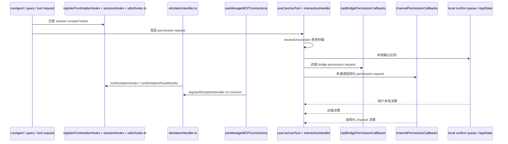

# 第 18 章 Hook、Elicitation 与权限回调链

> 对应源码主线：src/utils/hooks/registerFrontmatterHooks.ts、src/utils/hooks/sessionHooks.ts、src/utils/hooks.ts、src/services/mcp/elicitationHandler.ts、src/services/mcp/channelPermissions.ts、src/services/mcp/useManageMCPConnections.ts、src/hooks/useCanUseTool.tsx、src/hooks/toolPermission/handlers/interactiveHandler.ts、src/state/AppStateStore.ts

## 18.1 为什么这一章要把 Hook、Elicitation 和权限回调放在一起讲

表面看，这三件事分属不同模块：

- hooks 看起来像扩展机制
- elicitation 看起来像 MCP 表单/URL 交互
- permission callbacks 看起来像 UI 确认逻辑

但源码层面它们其实都在解决同一个问题：

- 当 Claude Code 遇到一个需要“外部决策”的瞬间，谁有权先介入、改写、拦截或确认

所以这一章真正的主题是：

- Claude Code 如何把外部干预点设计成统一的可组合仲裁链

## 18.2 registerFrontmatterHooks()：frontmatter 并不是声明式注释，而是会话期 hook 注入入口

`registerFrontmatterHooks()` 的职责非常明确：

- 读取 agent 或 skill frontmatter 中的 hooks 配置
- 把它们转成 session-scoped hooks
- 挂到指定的 sessionId 或 agentId 上

这里最关键的一点是：

- frontmatter hooks 不是立即执行
- 它们是先注册到 sessionHooks 状态里，等后续事件触发时再命中

这说明 frontmatter 在 Claude Code 里不是静态元数据，而是运行时扩展声明。

## 18.3 registerFrontmatterHooks() 里 Stop 到 SubagentStop 的转换非常重要

这个函数里有一个极有代表性的细节：

- 如果是 agent hooks，并且事件是 Stop，就自动转成 SubagentStop

这个转换说明 Claude Code 很清楚主会话和子代理的生命周期事件并不完全一样。

也就是说，hooks 体系不是一套松散的脚本触发器，而是绑定在精确定义的运行时事件模型上。

## 18.4 sessionHooks.ts：真正的 session-scoped hook 存储层

如果说 registerFrontmatterHooks 负责“把声明注册进来”，那么 `sessionHooks.ts` 负责的就是：

- 这些 hooks 在会话期间怎么存、怎么增删、怎么清理

这里最关键的状态是：

- `SessionHooksState = Map<string, SessionStore>`

它用 `sessionId -> hooks` 的映射，把 hooks 明确限定在会话边界里。

这说明 Claude Code 没有把运行中动态 hook 混进全局设置，而是明确区分：

- 持久配置
- 会话期注入

## 18.5 为什么 sessionHooks 用 Map 而不是普通对象

sessionHooks.ts 的注释已经把设计意图说得很直白：

- Map 的 `.set/.delete` 可以不改变容器 identity
- 返回 prev 不触发全量 listener 更新
- 高并发场景下避免 Record spread 带来的 O(N²) 成本

这说明 hook 体系不是低频边角功能。

尤其在 parallel workflow、schema-mode agents、大量 subagent 并发时，hook 的增删会非常频繁。

所以这里本质上是在为高并发 runtime 优化状态容器。

## 18.6 addSessionHook() / addFunctionHook() 说明 hook 并不只有 shell command 一种形态

sessionHooks.ts 同时支持两类 hook：

- HookCommand
- FunctionHook

其中 FunctionHook 直接把 callback 放进内存中，不能持久化到 settings.json。

这说明 Claude Code 的 hook 抽象不是单纯的“执行一条命令”，而是更广义的：

- 在某个运行时事件发生时插入一段可执行决策逻辑

这也是后面 permission / elicitation hooks 能参与仲裁的基础。

## 18.7 clearSessionHooks() 的存在说明 hook 生命周期是显式管理的

无论在 `utils/hooks.ts` 里的 session end 路径，还是在 `runAgent.ts` 里的 agent 收尾路径，都能看到：

- `clearSessionHooks(setAppState, sessionId)`

这说明 Claude Code 很明确地把 hook 当成会污染运行时环境的能力。

因此它必须在以下时刻主动清掉：

- session 结束
- subagent 结束
- 某些替换/恢复路径切换上下文时

换句话说，hook 注册不是“挂上就不管了”，而是有严格的生灭周期。

## 18.8 utils/hooks.ts：真正的 hook 执行总线在这里

`utils/hooks.ts` 很大，但这一章只要抓住几条关键线就够了：

- executeSubagentStartHooks
- executePermissionRequestHooks
- executeElicitationHooks
- executeElicitationResultHooks
- executeNotificationHooks
- executeSessionEndHooks

这说明 hook 系统已经横切到多个运行时阶段：

- agent 启动
- 权限请求
- MCP elicitation
- 通知上报
- session 结束

所以 hooks 在 Claude Code 里不是附属脚本点，而是一个跨子系统的事件执行总线。

## 18.9 executeSubagentStartHooks() 说明子代理启动前也有可干预窗口

`executeSubagentStartHooks()` 会构造：

- `hook_event_name: 'SubagentStart'`
- agent_id
- agent_type

然后把这份 hookInput 投进统一 hook 执行器。

这意味着子代理从创建开始就不是封闭黑箱。

在真正运行 query 之前，外部 hook 已经可以：

- 记录
- 拦截
- 施加策略

这和前面 agent 前置装配、权限模式重写的思路是一致的。

## 18.10 executePermissionRequestHooks() 说明权限请求不是 UI 事件，而是运行时事件

这一段非常关键。

它会把工具请求转成统一 hookInput：

- hook_event_name = PermissionRequest
- tool_name
- tool_input
- permission_suggestions

这说明 Claude Code 认为“请求权限”本身就是一个一等运行时事件。

也就是说，权限提示框并不是最底层真相。

更底层的真相是：

- 某个工具请求进入了一条可被 hook、classifier、bridge、channel、人类 UI 共同仲裁的决策链

## 18.11 elicitationHandler.ts：MCP elicitation 不是 UI 组件，而是协议事件转 AppState 队列的桥

`registerElicitationHandler()` 是本章最关键的文件之一。

它对 MCP client 做了两件事：

1. 注册 `ElicitRequestSchema` request handler
2. 注册 `ElicitationCompleteNotificationSchema` notification handler

这说明 elicitation 在 Claude Code 里不是临时弹出一个 dialog，而是：

- 一个 MCP request/notification 协议对
- 再被翻译成 AppState 中的 elicitation queue

## 18.12 runElicitationHooks() 在 UI 之前先给 hooks 一次程序化响应机会

在 `registerElicitationHandler()` 里，收到 request 后并不是立刻入队，而是先：

- `runElicitationHooks(serverName, request.params, signal)`

如果 hook 直接给出了结果，就会立即返回，不再走 UI。

这说明 elicitation 的处理顺序不是“先弹窗，再考虑别的”。

它遵循的是：

1. hook 先尝试程序化处理
2. 若没有结果，再进入 AppState queue
3. 用户或后续流程再给出响应

这和 permission race 的总体设计是一致的。

## 18.13 AppState 中的 elicitation.queue 说明交互状态被显式建模了

`registerElicitationHandler()` 会把事件塞进：

- `prev.elicitation.queue`

队列项里包含：

- serverName
- requestId
- params
- signal
- respond
- waitingState
- completed

这说明 elicitation 在 Claude Code 中不是一次性的 UI 事件，而是一个有状态的交互对象。

尤其 URL 模式下还有：

- waitingState
- onWaitingDismiss
- completion notification

这已经是一台小型状态机，而不是普通确认框。

## 18.14 runElicitationResultHooks() 让“用户已经回答”之后仍然可被二次改写

很多系统只允许在展示前拦截，但 Claude Code 这里还提供了第二层：

- `runElicitationResultHooks(...)`

也就是说，即便用户已经给出 `accept/decline/cancel`，结果仍然可以：

- 被 hook 覆盖
- 被 blockingError 改写为 decline
- 触发 notification hooks 做观测

这个设计的含义非常明确：

- elicitation 并不是一个由 UI 独占控制的终态决策点

## 18.15 useManageMCPConnections() 为什么要负责 registerElicitationHandler

这也是一个很值得注意的分层点。

连接建立后，并不是由 UI 某个组件自己订阅 elicitation，而是在：

- `useManageMCPConnections()` 的 onConnectionAttempt

里统一调用：

- `registerElicitationHandler(client.client, client.name, setAppState)`

这说明 Claude Code 把 elicitation handler 视为 MCP connection lifecycle 的一部分，而不是 REPL 的临时附加物。

换句话说：

- 只要一个 MCP client 成功接入，它的 elicitation 能力就应该立刻被挂接进全局状态系统

## 18.16 channelPermissions.ts：多通道权限批准不是文本聊天 hack，而是结构化权限通道

这一块设计非常精细。

`channelPermissions.ts` 定义了：

- `ChannelPermissionCallbacks`
- `createChannelPermissionCallbacks()`
- `filterPermissionRelayClients()`
- `shortRequestId()`
- `PERMISSION_REPLY_RE`

注释已经把边界说得很清楚：

- 批准动作不是普通聊天文本直接解析后自动生效
- 而是 channel server 先解析，再发 structured notification
- Claude Code 只消费结构化 `{request_id, behavior}` 事件

这说明系统非常注意防止“普通聊天文本误触发批准”。

## 18.17 createChannelPermissionCallbacks() 的关键不是 callback 本身，而是 pending map 的生命周期设计

这里和 sessionHooks 的思路很像。

它把 pending 请求 resolver 放在闭包里的 Map 中，而不是：

- 模块级全局变量
- 或者直接塞进 AppState

这样做的好处是：

- 生命周期跟随当前 session hook 实例
- 函数不需要被序列化进状态
- resolve 可以先删后调，避免重复事件或异常重入

所以它本质上是一个非常轻量的 permission rendezvous registry。

## 18.18 AppStateStore 里的 channelPermissionCallbacks 说明回调本身也要被挂进全局运行时

虽然 resolver Map 不放进 AppState，但 `AppStateStore` 仍然显式保存：

- `channelPermissionCallbacks?`
- `replBridgePermissionCallbacks?`

这说明 Claude Code 需要让权限仲裁器在多个层次共享：

- interactive handler
- bridge
- MCP 连接层
- UI 队列

也就是说，全局状态里保存的不是“每个请求”，而是“访问这些请求仲裁能力的入口”。

## 18.19 useManageMCPConnections()：channel permission callbacks 在这里创建并注入 AppState

`useManageMCPConnections()` 里会：

1. 构造 `channelPermCallbacksRef`
2. 在 feature gate 和 runtime gate 通过时，把 callbacks 写进 AppState
3. 卸载时再清掉

这说明 channel permission relay 不是天生就开着，而是一个：

- 连接层启用
- 运行时注入
- 会话期可用

的能力。

这和 frontmatter hooks、session hooks 的生命周期管理逻辑是相通的。

## 18.20 useCanUseTool.tsx：权限决策真正汇合的总入口

真正把这些线汇总起来的，是 `useCanUseTool.tsx`。

当 automated checks 走到需要 ask 的分支时，它会调用：

- `handleInteractivePermission(...)`

同时把这些仲裁来源一起带过去：

- `bridgeCallbacks`
- `channelCallbacks`
- 当前 permission context
- classifier 状态

这意味着 useCanUseTool 不是单纯“问一下用户”，而是在发起一场多来源竞争决策。

## 18.21 interactiveHandler.ts：权限 race 的真正调度器

`handleInteractivePermission()` 是本章另一个核心。

它会构造一个 `resolveOnce/claim()` 机制，然后同时放出多条竞争支路：

- 本地终端 UI 队列
- bridge response from CCR
- channel permission relay
- hooks / classifier / recheckPermission

谁先拿到 claim，谁就终结这次权限请求。

这就是这一章最重要的设计结论：

- Claude Code 的权限批准不是单通道确认，而是一条权限仲裁链；源码注释中的 `first-wins arbitration` 正是在描述这件事。

## 18.22 interactiveHandler 里 channel relay 的接法非常克制

这里并不是所有工具都能直接走 channel relay。

源码里明确限制：

- 要有 channelCallbacks
- 工具不能要求复杂 user interaction
- 还要经过 allowlist 和 capability 过滤

之后才会：

- 为当前 toolUseID 生成 `shortRequestId`
- 找出支持 `claude/channel/permission` 的 MCP clients
- 发送结构化 permission request
- 订阅 response
- 与本地 UI / bridge 并发竞争

这说明多通道批准能力是被严格包进现有权限模型中的，而不是旁路后门。

## 18.23 interactiveHandler 为什么要用 createResolveOnce/claim

这个设计非常关键。

因为权限请求可能同时收到：

- 本地 UI allow
- bridge allow
- channel allow
- hook auto-approve
- classifier auto-approve
- recheckPermission allow

如果没有原子 claim，就会出现：

- 重复 resolve
- 队列未清理
- bridge prompt 残留
- channel stale reply 误命中

所以这个函数真正解决的是多决策源竞争条件下的一致性问题。

## 18.24 这一章最值得记住的仲裁链图

## 18.25 这一章的阅读结论

Claude Code 在外部干预点上的设计非常统一。

无论是：

- frontmatter hooks
- session hooks
- MCP elicitation
- bridge permission
- channel permission relay
- 本地 terminal confirm

本质上都在参与同一个更高层抽象：

- 对运行时关键决策点进行多来源仲裁

所以真正应该记住的结论不是“这里有很多回调”，而是：

- Claude Code 把权限与交互设计成了可扩展、可组合、可竞争的一套决策基础设施

## 18.26 这一章和后续章节怎么衔接

第 18 章是后半本书里一个非常关键的连接点，因为它把多条此前分散的线收拢到了一起：

1. 第 15 章里的 agent hooks、独立 permissionMode 和子代理上下文，到这里正式汇合成 session-scoped hook 与 interactive permission race。
2. 第 16 章里的 MCP connection lifecycle，到这里继续展开成 elicitation handler、channel permission relay 和连接期回调注册。
3. 第 19 章里的 swarm mailbox、leader 审批桥接，本质上是在这里这条权限仲裁链上再增加一个 teammate 来源。
4. 第 20 章里的 bridge permission callbacks、direct connect permission request 和 remote session 回传，也是在复用这里定义的“多来源 first-wins arbitration”模型。

所以如果说第 17 章是任务状态机的中轴，那么第 18 章就是权限仲裁链的中轴。后面看到 swarm 和 remote control 时，只要重新回到这一章，就能迅速看清它们为什么没有各做一套单独审批系统。
